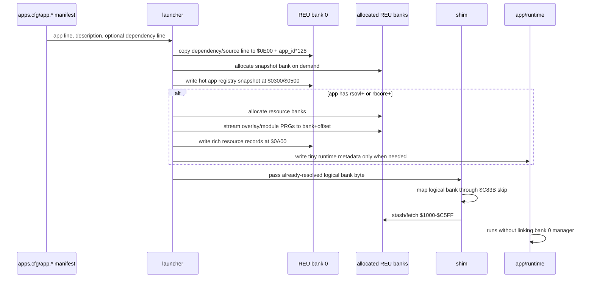
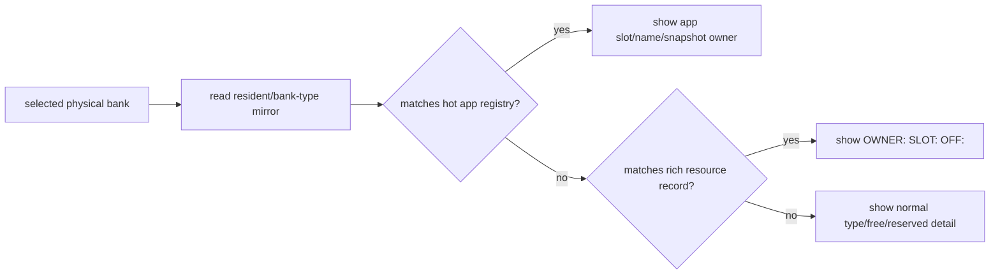

# ReadyOS REU Enhancement Refactor - Phase 1 Completed

<!-- READYOS-CURRENT-CONTRACT-2026-08-02 -->
> **Current ReadyOS contract (2026-08-02):** Physical `Skip` is the ReadyOS
> bank and `Skip+1` is the first dynamic bank. The launcher snapshot occupies
> ReadyOS `$0000-$B5FF`; schema v5 occupies `$B600-$FFFF`, including the token
> map at `$B740` and status at `$B840`. C64 app RAM is `$1000-$C5FF` (`$B600`),
> and the resident 1 KB shim owns `$C600-$C9FF` with its public ABI at `$C800`.
> Dated layouts and measurements below are retained as historical evidence.

> **Superseded intermediate checkpoint (2026-08-01):** this remains the Phase 1
> evidence record, but its logical-bank-0 control bank and `$C600-$C7FF` RAM
> mirror were first replaced by an intermediate schema-v5 design using physical
> `Skip+1`, a `$0000-$B7FF` launcher snapshot, metadata from `$B800`, and
> `$C600-$C7FF` app-private RAM. That intermediate placement was itself replaced
> by the current physical-`Skip` / `$B600` / 1 KB-shim contract summarized
> immediately above. See `docs/ReadyOS_SHIM_ARCHITECTURE_0.2.5.md` and
> `privatedocs/top_level_md/MEMORY_MAP.md` for the active contract.

## Phase 1 Completion Note

This document is the completed Phase 1 implementation record for the REU
control-bank and dynamic-resource refactor. Phase 1 is complete as of the
`codex/reu-control-bank-refactor` branch checkpoints through 2026-06-07:
logical REU bank `0` is active, app snapshots are dynamically allocated,
ReadyShell and ReadyBASIC loader-owned resources are dynamically assigned,
app-owned runtime REU allocations can be owner-recorded without shim growth,
REU Viewer consumes bank `0` metadata, physical REU size is launcher-owned,
and both regular plus EasyFlash/cartridge VICE suites passed.

The active future plan has moved to `futureREUrefactor.md`. The historical
future-design sections below are preserved for context, but they are no longer
the primary source of truth for pending work. When this document conflicts with
`futureREUrefactor.md`, use `futureREUrefactor.md` for future work.

## Purpose

This plan describes a future refactor that turns logical REU bank `0` into a
ReadyOS control bank while preserving the current ReadyOS memory contracts,
especially the resident shim and shim-adjacent metadata area.

The intended long-term end state is:

- logical REU bank `0` is the canonical ReadyOS REU control bank;
- the resident `$C600-$C9FF` area remains small, fixed, and ABI-stable;
- the shim itself does not grow;
- app snapshots, overlays, modules, clipboard payloads, ReadyShell resources,
  ReadyBASIC resources, and app-requested banks are tracked by owner;
- apps can be loaded/preloaded dynamically instead of being tied to fixed app
  banks;
- ReadyOS can eventually support more app catalog entries, with an initial
  target of up to `64`;
- future app/service invocation has reserved design space for REU-backed
  request/result data, including headless calls and modal UI service calls such
  as shared file open/save dialogs;
- all changes are proven against before/after code size, BSS, heap/headroom,
  overlay, micromodule, suspend/resume, and launcher/shim behavior.

This document is now both the plan and the source-of-truth implementation
tracker for the REU enhancement refactor. Completed implementation status is
recorded explicitly; future design notes remain design notes until marked
implemented here.

## Current Plan Status 2026-06-06

This is the current source-of-truth checkpoint after the physical REU-size
authority work, full disk VICE regression, and full EasyFlash/cartridge VICE
regression.

Implemented and verified:

- logical REU bank `0` is the ReadyOS control bank (`RCB0` schema version `4`);
- the resident `$C600-$C9FF` shim-adjacent region remains the same `1KB`
  shape:
  - `$C600-$C6FF`: hot 256-byte bank allocation/type table;
  - `$C700-$C7FF`: existing resident system metadata/reserved area;
  - `$C800-$C9FF`: 512-byte resident shim;
- the resident shim remains exactly `512` bytes;
- shim app-token lookup uses the bounded bank `0` byte lookup page instead of
  fixed reserved app slots;
- app snapshots are allocated lazily/dynamically instead of being preallocated
  into fixed reserved `R` banks;
- the launcher supports 64-entry catalogs without keeping full catalog text in
  C64 RAM;
- disk `apps.cfg` and `app.*` manifests support explicit dependency/resource
  lines for the concrete known resource sets currently implemented;
- ReadyShell overlay cache banks, state/scratch bank, CAT staging, and
  diagnostic/probe bytes are loader-owned dynamic resources rather than fixed
  `$40/$41/$42/$43/$48` banks;
- ReadyShell consumes small generated runtime metadata for overlay bank/offset
  lookup instead of linking the full registry machinery;
- ReadyBASIC core/code/module resource banks are launcher/cartridge-assigned
  resources rather than fixed slots;
- launcher-owned unload frees app snapshots and launcher-owned resource banks;
- launcher-owned unload also frees owner-recorded app-owned runtime allocation
  banks (`REU_APP_ALLOC`) for apps that opt into the owned-allocation
  micromodule;
- REU Viewer reads bank `0` relationship metadata and can describe app
  snapshots, resource owners, overlays/modules, and unavailable physical banks;
- physical REU size is launcher-owned:
  - launcher probes once at startup;
  - unavailable physical tail banks are marked `REU_UNAVAIL` in `$C600-$C6FF`;
  - bank `0` header publishes encoded physical bank count and first
    unavailable bank;
  - REU Viewer consumes the launcher-published physical size and no longer
    reports impossible totals such as `211/128`;
- EasyFlash/cartridge metadata is generated from the same effective resource
  layout and passed the cartridge-specific loader/preload regression paths.

Most recent verification pass:

- `python3 build_support/verify_reu_control_bank.py`;
- `python3 build_support/verify_dynamic_launcher.py`;
- `git diff --check`;
- regular ReadyBASIC VICE suites:
  `READYBASIC_VISIBLE=0 READYBASIC_KEEP_VICE=0 make readybasic-vice-suites`;
- regular ReadyShell VICE:
  `READYSHELL_VISIBLE=0 build_support/run_readyshell_cross_app_resume_probe.sh`;
- full EasyFlash/cartridge VICE suites:
  `READYBASIC_VISIBLE=0 READYBASIC_KEEP_VICE=0 READYSHELL_VISIBLE=0 make easyflash-vice-suites`.

Current memory discipline result:

- normal apps do not link the bank `0` writer or the physical REU alias probe;
- launcher and REU Viewer intentionally pay the registry/display cost;
- physical-size detection adds one launcher BSS byte and no REU Viewer BSS;
- ReadyBASIC remains the tightest app-window contract and must continue to be
  protected from shared-library growth.

Still left in the plan:

- generic arbitrary dependency loading for unknown app-specific overlays or
  modules beyond the concrete `rsovl` and `rbcore` resource contracts;
- generic future resource-set ownership records for arbitrary plugin/module
  systems beyond the implemented owner-recorded `REU_APP_ALLOC` path;
- a checked-in REU Viewer VICE regression that navigates selected banks and
  asserts visible owner/detail text, beyond the focused screenshot probes and
  static schema checks already run;
- a C64-side or otherwise reliable runtime bank `0` validator that reads the
  `RCB0` header/table/resource records directly from REU during VICE
  automation;
- headless app/service invocation records and dispatcher;
- modal UI service invocation, including the future shared file open/save
  service path;
- service-temp resource cleanup semantics for those future service flows;
- possible future schema cleanup of historical reserved/overlapping areas once
  the current v4 layout has stayed stable across more feature work.

## Implementation Status 2026-06-04

Completed in branch `codex/reu-control-bank-refactor` after the v2 registry
checkpoint:

- logical REU bank `0` mirror schema advanced to `RCB0`, version `3`;
- the hot app registry remains array-shaped and cheap to copy:
  - `$0300`: 64-entry app-state arrays;
  - `$0500`: compact app filename/token records;
  - `$0900`: per-app resource-bank arrays;
- richer loader-owned relationship metadata now lives outside the hot copy path:
  - `$0A00`: 64 compact 16-byte resource/file records containing app owner,
    resource set, resource kind, physical bank, offset, length, flags, next
    index, overlay slot, source drive, and a short name tag;
  - `$0E00`: 64 fixed 128-byte dependency/source lines copied from disk
    `apps.cfg` or `app.*` manifests;
- the disk launcher no longer hard-codes the ReadyShell overlay file table,
  bank ordinal table, or slot offsets. ReadyShell `rsovl+` placement is read
  from the dependency line using `name@resourceBankOrdinal:offset`;
- shipped disk catalogs and manifests now carry the explicit ReadyShell packing
  line:

```text
rsparser@0:0000,rsvm@0:3800,rsdrvilst@0:7000,rsldv@1:0000,rsstv@0:a800,rsfops@1:3800,rscat@1:7000,rscopy@1:a800,rsedit@2:0000
```

- the launcher still owns allocation/unload policy. On load it writes rich
  resource records for ReadyShell overlays and ReadyBASIC module banks; on
  unload it clears records for the app before freeing those banks;
- apps that need runtime `REU_APP_ALLOC` banks can opt into the separate
  `reu_owned_alloc` micromodule. It writes strict
  `REUCB_DEP_KIND_APP_ALLOC` records in the `$0A00` rich-resource table with
  owner app id, slot id, physical bank, and a four-character tag. The primitive
  `reu_mgr_alloc.c` allocator remains small for apps that do not need owner
  metadata;
- launcher unload now also frees owner-recorded `REU_APP_ALLOC` banks when the
  selected app is unloaded. The resident shim remains unchanged; this is
  launcher plus global REU bank `0` policy;
- REU Viewer displays app-owned runtime banks as `APP ALLOC` and uses the
  owner record to show the owning app plus tag, for example QuickNotes note
  banks tagged `NOTE`;
- ReadyShell consumes only the small v4 `OV` metadata block with nine
  `(bank, offset)` records. That keeps ReadyShell from linking the larger
  registry machinery;
- EasyFlash remains generated/static at build time, but now writes the same v4
  ReadyShell metadata shape and mirrors equivalent rich resource records into
  bank `0`;
- REU Viewer now uses the bank `0` metadata to show whether the selected bank is
  an app snapshot, which app slot/name owns it, or which overlay/module record
  is stored in it;
- static verifiers now reject:
  - a launcher-side return to hard-coded ReadyShell overlay placement;
  - dependency writers that erase the source line when the source is the
    launcher dependency buffer;
  - schema regressions in the v3 bank `0` rich-record layout;
  - EasyFlash v4 ReadyShell metadata verifier drift.

Final measured v3 rich-registry impact against the accepted v2 bank-0 registry
baseline:

| App | Before | Final | Delta |
| --- | ---: | ---: | ---: |
| launcher | 3583 | 1009 | -2574 |
| editor | 11712 | 11712 | 0 |
| quicknotes | 9518 | 9518 | 0 |
| calcplus | 6715 | 6715 | 0 |
| hexview | 32399 | 32399 | 0 |
| clipmgr | 13561 | 13561 | 0 |
| reuviewer | 29572 | 28781 | -791 |
| sysinfo | 30021 | 30021 | 0 |
| tasklist | 6069 | 6069 | 0 |
| simplefiles | 12636 | 12636 | 0 |
| game2048 | 28580 | 28580 | 0 |
| deminer | 22167 | 22167 | 0 |
| cal26 | 8751 | 8751 | 0 |
| dizzy | 1834 | 1834 | 0 |
| readyirc | 29006 | 29006 | 0 |
| rirc-rrnet | 18220 | 18220 | 0 |
| readybasic | 1029 | 1029 | 0 |
| readme | 22748 | 22748 | 0 |
| readyshell | 18660 | 18327 | -333 |

Interpretation: normal apps and ReadyBASIC do not pay for the rich bank `0`
registry. The cost is concentrated in the launcher, which owns parse/load/unload
policy, and REU Viewer, which displays the relationship data. ReadyShell pays
333 bytes for consuming dynamic bank/offset overlay metadata while still
avoiding the large registry writer.

Verification completed for this v3 checkpoint:

- `python3 -m py_compile build_support/build_apps_catalog_petscii.py build_support/readyos_easyflash.py build_support/verify_reu_control_bank.py build_support/verify_dynamic_launcher.py build_support/vice_easyflash_smoke.py verify.py`;
- `python3 build_support/verify_reu_control_bank.py`;
- `python3 build_support/verify_dynamic_launcher.py`;
- `make verify`;
- `make readyshell-host-tests`;
- `READYSHELL_VISIBLE=0 build_support/run_readyshell_cross_app_resume_probe.sh`;
- `make easyflash-verify`.

The EasyFlash smoke now verifies the full 36-byte v4 overlay metadata region at
`$C760-$C783`, including multi-line VICE monitor dumps. Earlier verifier logic
only compared the first 16-byte monitor row and was corrected.

ReadyBASIC headless VICE suite status for this checkpoint is tracked in
`agentworking/reu_rich_registry_working_notes.md` and should be kept current
with the final command result before the branch is merged.

## Physical REU Size Authority Checkpoint 2026-06-06

This checkpoint makes physical REU size a launcher-owned system fact instead
of a REU Viewer local probe. The practical bug it fixes is the 8MB case where
the resident table correctly had unavailable banks but REU Viewer still counted
past the physical end and could report impossible totals such as `211/128`
free banks.

Implemented:

- logical REU bank `0` mirror schema advanced to `RCB0`, version `4`;
- the resident `$C600-$C6FF` allocation table remains the hot 256-byte bank
  classification table, but the launcher now probes physical REU size during
  `launcher_init()` before app/resource allocation;
- banks beyond the detected physical end are marked `REU_UNAVAIL` (`0x0A`) in
  `$C600-$C6FF`;
- the existing bank `0` mirror at `$0100-$01FF` receives those unavailable
  markers just like any other hot table state;
- the `RCB0` header publishes the encoded physical bank count at byte `44`,
  the first unavailable bank at byte `45`, and feature flags at byte `46`;
- the encoding remains one byte: `0` means `256` physical banks, otherwise the
  byte value is the physical bank count and first unavailable bank;
- REU Viewer no longer probes or writes REU just to discover size. It reads the
  launcher-published header byte when bank `0` is valid, with a table-derived
  fallback only for broken/missing control-bank state;
- EasyFlash static preload marking now respects `REU_UNAVAIL`, so cartridge
  generated resource banks cannot accidentally overwrite unavailable physical
  slots in smaller REU configurations.

Shim and resident-memory status:

- no shim code or shim ABI byte changed in this checkpoint;
- the `$C800-$C9FF` resident shim remains exactly `512` bytes;
- the full shim-adjacent resident region remains the same `1KB`:
  - `$C600-$C6FF`: 256-byte bank allocation/type table;
  - `$C700-$C7FF`: existing system metadata/reserved bytes;
  - `$C800-$C9FF`: 512-byte resident shim;
- no new resident table was added. The physical-size fact is represented by
  existing `REU_UNAVAIL` entries in `$C600-$C6FF` plus three header bytes in
  logical REU bank `0`.

Micromodule split:

- `src/lib/reu_phys.c` is the tiny shared table-policy helper linked by the
  launcher, REU Viewer, and control-bank writer;
- `src/lib/reu_phys_probe.c` is linked by the launcher only. This keeps the
  alias-probe code and its one-byte BSS scratch out of REU Viewer and normal
  apps;
- `src/lib/reu_control_bank.c` derives the published physical count from the
  allocation table when writing the `RCB0` header.

Measured app-window impact against the pre-checkpoint snapshots in
`agentworking/reu_physical_size_headroom_before.json` and
`agentworking/reu_physical_size_easyflash_headroom_before.json`:

| App | Before | Final | Delta | CODE | RODATA | DATA | BSS |
| --- | ---: | ---: | ---: | ---: | ---: | ---: | ---: |
| launcher | 5861 | 5374 | -487 | +486 | 0 | 0 | +1 |
| launcher_easyflash | 18209 | 17757 | -452 | +451 | 0 | 0 | +1 |
| reuviewer | 29540 | 29411 | -129 | +131 | 0 | 0 | -2 |

Interpretation: the only BSS cost is the launcher probe byte. REU Viewer pays
small CODE for displaying the system-owned size but drops its local probe
scratch. Normal apps do not link either physical-size module.

Focused verification/screenshot evidence before full slow regression:

- static control-bank verifier updated for schema `4` and the physical-size
  module split;
- 8MB VICE run `logs/vice_auto_20260606_193409` showed
  `PHYS:128`, `FREE:83`, `CB:OK`, and banks `$80-$FF` displayed as
  unavailable;
- 16MB VICE run `logs/vice_auto_20260606_193505` showed
  `PHYS:256`, `FREE:211`, and no unavailable physical tail.

Full regression verification completed after the checkpoint:

- `python3 build_support/verify_reu_control_bank.py`;
- `python3 build_support/verify_dynamic_launcher.py`;
- `git diff --check`;
- regular ReadyBASIC VICE suites via `READYBASIC_VISIBLE=0
  READYBASIC_KEEP_VICE=0 make readybasic-vice-suites`;
- regular ReadyShell VICE probe via
  `READYSHELL_VISIBLE=0 build_support/run_readyshell_cross_app_resume_probe.sh`;
- full EasyFlash/cartridge VICE suites via `READYBASIC_VISIBLE=0
  READYBASIC_KEEP_VICE=0 READYSHELL_VISIBLE=0 make easyflash-vice-suites`.

The cartridge run generated EasyFlash plans from the regular plans and passed
the ReadyBASIC demo, repeat/label, lifecycle, module overlay, plugin command,
program, `rbtest1`, minimal resume, screen REU temp, state, large-vars,
cross-app resume, second-entry/editor, full visual verification, and ReadyShell
cross-app/CAT probes. This is the current proof point that both disk and
cartridge SKUs honor the same physical-size/unavailable-tail contract.

## App-Owned Runtime Allocation Checkpoint 2026-06-07

This checkpoint adds ownership tracking for app-requested `REU_APP_ALLOC`
banks without adding shim code and without making the primitive allocator
heavier for apps that do not need ownership records.

Implemented:

- added `src/lib/reu_owned_alloc.c` / `src/lib/reu_owned_alloc.h` as an
  optional micromodule layered over `reu_mgr_alloc.c`;
- the primitive allocator remains the small common implementation. Apps link
  the owned allocator only when they need bank `0` ownership records;
- QuickNotes now records its two note-storage banks with slot ids `1` and `2`
  and tag `NOTE`;
- ReadyIRC and rirc-rrnet now record their scrollback banks with slot id `1`
  and tag `SCRL`;
- owner records use `REUCB_DEP_KIND_APP_ALLOC` in the `$0A00` rich-resource
  table and carry app id, slot id, physical bank, and a four-character tag;
- allocation is strict: if the owner record cannot be written, the newly
  allocated bank is immediately freed and allocation fails;
- launcher unload scans the rich-resource table for the selected app and frees
  matching banks only when the hot allocation table still marks the bank as
  `REU_APP_ALLOC`, preventing stale metadata from freeing the wrong type;
- REU Viewer displays owner-recorded runtime banks as `APP ALLOC` with the
  owning app and tag.

Shim and resident-memory status:

- no shim code or shim ABI byte changed;
- the `$C800-$C9FF` resident shim remains exactly `512` bytes;
- the `$C600-$C9FF` shim-adjacent resident region remains the same `1KB`;
- all relationship detail lives in logical REU bank `0`, not in new resident
  tables.

Measured app-window impact against
`agentworking/reu_owned_alloc_headroom_before.json`:

| App | Before | After | Delta | Notes |
| --- | ---: | ---: | ---: | --- |
| launcher | 5387 | 5242 | -145 | unload scan for owner-recorded app allocations |
| quicknotes | 9851 | 9164 | -687 | links owned allocator for note banks |
| readyirc | 29339 | 28657 | -682 | links owned allocator for scrollback |
| rirc-rrnet | 18553 | 17871 | -682 | links owned allocator for scrollback |
| reuviewer | 29523 | 29454 | -69 | displays app-allocation tag details |
| editor | 11768 | 11768 | 0 | no link impact |
| readybasic | 1029 | 1029 | 0 | no link impact |
| readyshell | 18185 | 18185 | 0 | no link impact |

Verification completed:

- `make verify`;
- `READYBASIC_VISIBLE=0 READYBASIC_KEEP_VICE=0 make readybasic-vice-suites`;
- `QUICKNOTES_OWNED_REU_VISIBLE=0 QUICKNOTES_OWNED_REU_KEEP_VICE=0 make
  quicknotes-owned-reu-vice`;
- `LAUNCHER_REU_STATE_SKIP_BUILD=1 LAUNCHER_REU_STATE_VISIBLE=0
  build_support/run_launcher_reu_state_probe.sh`;
- `READYSHELL_VISIBLE=0 build_support/run_readyshell_cross_app_resume_probe.sh`;
- `make easyflash-smoke`;
- `READYSHELL_VISIBLE=0 make easyflash-readyshell-vice-suites`;
- `git diff --check`.

Focused QuickNotes evidence:

- before unload run: `logs/vice_auto_20260607_173802`;
- after unload run: `logs/vice_auto_20260607_173831`;
- the before run asserted QuickNotes-owned banks in the hot allocation table
  and REU Viewer displayed `APP ALLOC`, `OWNER: QUICKNOTES`, and `TAG NOTE`;
- the after run unloaded QuickNotes, asserted those hot-table entries were
  free, and REU Viewer displayed the former bank as `TYPE: FREE`.

## REU Bank-0 Lookup Checkpoint 2026-06-06

This checkpoint removes the remaining false "reserved app slot" pool from the
runtime REU map and moves shim-facing app-token resolution into logical REU
bank `0`.

Implemented:

- 2026-06-07 update: the unused launcher overlay bank reservation was
  removed. `skip+2` is now the first dynamic/resource allocation bank, logical
  bank `1` can map to `skip+2`, and the launcher keeps only its `skip+1`
  snapshot/resume bank.
- logical app snapshot tokens still use the same one-byte ABI passed through
  `$C820`, `$C834`, and the hotkey/suspend/resume paths;
- the resident shim no longer computes app physical banks as `skip + 1 +
  token`. For non-zero tokens, `reu_setup_logical` fetches one byte from
  logical bank `0` at `$2F00 + token` into `$C83D`, then jumps to the existing
  physical-bank setup helper at `$C9A0`;
- token `0` remains the launcher snapshot and still resolves directly to
  `skip + 1`, so boot/preload launcher restore does not depend on the lookup
  page;
- the control-bank writer publishes the 256-byte shim lookup page at
  `$2F00-$2FFF`. Current entries use the compact physical formula
  (`token 1 -> skip + 2`, etc.) when no explicit override is present, but the authority is
  now in REU bank `0`;
- `REU_FIRST_DYNAMIC_PHYSICAL()` now starts at `skip + 2`, immediately after
  ReadyOS global and launcher snapshot banks;
- bitmap sync no longer repopulates `REU_RESERVED` placeholders for clear
  low-token app bits. Existing old `REU_RESERVED` entries are collapsed to
  `REU_FREE`, while explicit launcher-owned `REU_APP_STATE` allocations are
  preserved until launcher unload/free clears them;
- disk and EasyFlash resource-bank allocation now starts at the same dynamic
  base and skips banks already marked used, rather than preserving a hidden
  `skip+2..skip+25` gap;
- the shim remains exactly `512` bytes. `$C83D` is now the one-byte lookup
  scratch byte; `$C83E-$C83F` remain reserved.

Measured app-window headroom impact against the pre-checkpoint snapshot in
`agentworking/reu_bank0_lookup_headroom_before.json`:

| App | Before | After | Delta |
| --- | ---: | ---: | ---: |
| launcher | 5953 | 5841 | -112 |
| editor | 11730 | 11967 | +237 |
| quicknotes | 9536 | 9773 | +237 |
| calcplus | 6745 | 7170 | +425 |
| hexview | 32429 | 32854 | +425 |
| clipmgr | 13591 | 14016 | +425 |
| reuviewer | 28827 | 29010 | +183 |
| tasklist | 6087 | 6324 | +237 |
| cal26 | 8769 | 9006 | +237 |
| readyirc | 29024 | 29261 | +237 |
| rirc-rrnet | 18238 | 18475 | +237 |

Interpretation: the launcher pays 112 bytes for the lookup-page writer/mirror
path. Apps that link the split REU allocation helper recover 183-425 bytes
because the old "free low app slot but preserve reserved placeholder" code path
was removed. ReadyBASIC and ReadyShell app-window headroom did not materially
move in this checkpoint.

Verification completed:

- `python3 build_support/verify_readyos_shim.py`;
- `python3 build_support/verify_dynamic_launcher.py`;
- `python3 build_support/verify_memory_map.py`;
- `bash run.sh --build-all`.

## ReadyShell State-Bank Diagnostic/CAT Checkpoint 2026-06-06

This checkpoint retires ReadyShell's last fixed `$43` REU dependency without
adding a new bank, new shim ABI, or a launcher-side special case for CAT.

Implemented:

- `REU_RS_DEBUG` and `REU_BANK_RS_DEBUG` were removed from the REU manager
  contract, allocator fixed-bank filters, bank-0 control-bank seed records, and
  memory-map verifier inputs;
- ReadyShell's one-byte REU availability probe now uses the loader-assigned
  ReadyShell state bank, at relative offset `+$7FFF`, instead of fixed bank
  `$43`;
- the overlay debug/verification ring moved into the tail of the same
  ReadyShell state bank:
  - debug head: `+$7DE0`;
  - debug data: `+$7DF0-+$7FEF`;
  - probe byte: `+$7FFF`;
- the generic ReadyShell command scratch window now ends at `+$7DDF`, reserving
  the `+$7DE0-+$7FFF` diagnostic tail;
- CAT no longer stages data in fixed `$43D800`. It uses the existing
  command-scratch base, exactly like LST/LDV/STV/PUT/ADD, and remains safe
  because ReadyShell command overlays execute serially through one live overlay
  window;
- REU Viewer now reports the loader-assigned ReadyShell state/scratch bank as
  `T` instead of showing a misleading fixed `D` debug bank;
- generated ReadyShell overlay inventory docs now compute diagnostic placement
  from the state-bank-relative constants, so disk and cartridge generated-bank
  layouts remain accurate.

Current ReadyShell state-bank layout:

```text
$0000-$7DDF  shared transient command scratch
$0000-$17FF  CAT staging while CAT is active
$7DE0-$7FFF  diagnostics/probe tail
$8000-$80FF  heap metadata / command registry block
$80F0-$8113  shared ReadyShell overlay metadata
$8114        pause flag
$8120-$FEFF  persistent REU value arena
$FF00-$FFFF  unused tail
```

Intentional capacity tradeoff:

- generic command scratch: `32768` -> `32224` bytes (`-544`);
- CAT is unchanged at its existing `6144` byte staging envelope, because it
  only uses the front of scratch while active;
- the ReadyShell value arena remains `32224` bytes;
- the shim remains exactly `512` bytes and does not learn about this placement.

Measured app-window headroom impact against
`agentworking/readyshell_statebank_debug_cat_headroom_before.json`:

| App | Before | After | Delta |
| --- | ---: | ---: | ---: |
| launcher | 5841 | 5861 | +20 |
| editor | 11967 | 11999 | +32 |
| quicknotes | 9773 | 9805 | +32 |
| calcplus | 7170 | 7219 | +49 |
| hexview | 32854 | 32903 | +49 |
| clipmgr | 14016 | 14065 | +49 |
| reuviewer | 29010 | 29073 | +63 |
| tasklist | 6324 | 6356 | +32 |
| cal26 | 9006 | 9038 | +32 |
| readyirc | 29261 | 29293 | +32 |
| rirc-rrnet | 18475 | 18507 | +32 |
| readyshell | 18207 | 18185 | -22 |

Interpretation: ReadyShell pays 22 bytes of resident app-window headroom for
state-bank-relative diagnostics/probe access. REU manager consumers recover
small amounts because the retired fixed debug-bank type no longer participates
in fixed-bank filtering and viewer display logic.

Verification for this checkpoint must include a ReadyShell VICE CAT probe using
the shipped `RSHELP` SEQ file, plus the normal regular and cartridge VICE
suites. The generated cross-app ReadyShell probe now runs:

```text
VER
LST "RSHELP"
VER
CAT "RSHELP" ! TOP 1
VER
```

Regular ReadyShell CAT/cross-app probe status:

- `READYSHELL_SKIP_BUILD=1 READYSHELL_VISIBLE=0 build_support/run_readyshell_cross_app_resume_probe.sh` passed on 2026-06-06;
- run artifact: `logs/vice_auto_20260606_144857`;
- captured screen confirms `CAT "RSHELP" ! TOP 1` prints `READYSHELL QUICK REF`
  and returns to `VER`.

Regular and cartridge suite status for this checkpoint:

- `READYBASIC_VISIBLE=0 READYBASIC_KEEP_VICE=0 make readybasic-vice-suites`
  passed on 2026-06-06. Notable artifacts include
  `logs/vice_auto_20260606_150934` for the 211-step regular ReadyBASIC
  cross-app resume probe and `logs/vice_auto_20260606_151405` for the
  184-step regular full-suite visual verification.
- `READYBASIC_VISIBLE=0 READYBASIC_KEEP_VICE=0 READYSHELL_VISIBLE=0 make
  easyflash-vice-suites` passed on 2026-06-06. Notable artifacts include
  `logs/vice_auto_20260606_154237` for the 213-step EasyFlash ReadyBASIC
  cross-app resume probe, `logs/vice_auto_20260606_154716` for the 186-step
  EasyFlash full-suite visual verification, and
  `logs/vice_auto_20260606_155519` for the EasyFlash ReadyShell cross-app
  probe with `VER`, `LST`, `CAT "RSHELP" ! TOP 1`, and post-CAT `VER`.

## Cartridge Stabilization Checkpoint 2026-06-04

The cartridge SKU is now aligned with the same resource-ownership pattern as
the disk launcher without adding new shim ABI or teaching the cartridge launcher
a separate hard-coded resource contract.

Implemented cartridge-specific corrections:

- EasyFlash catalog generation emits ReadyShell overlay resource rows from the
  same generated layout data used by the cartridge preload image.
- EasyFlash boot writes the 36-byte ReadyShell v4 `OV` metadata block from its
  generated `OVERLAY_TABLE_RAM` values into the generated ReadyShell state
  bank. The runtime metadata byte order is the same as the disk launcher
  contract: `(bank, offset_lo, offset_hi)`.
- The EasyFlash launcher mirrors equivalent rich resource records into logical
  bank `0`, so REU Viewer and later owner/unload diagnostics see the same
  relationship shape even though cartridge resources are generated/static.
- ReadyShell still consumes only the tiny metadata block at offset `$80F0`
  inside its loader-assigned state bank plus assigned `(bank, offset)` values.
  It does not parse the bank `0` registry and does not allocate or free its own
  overlay cache/state banks.
- ReadyBASIC cartridge first-entry startup now validates restored BASIC runtime
  state before trusting it. If the hidden saved zero page/CHRGET/TXTPTR state is
  not credible, ReadyBASIC falls back through its own cold-start path, runs the
  BASIC ROM zero-page initializer at `$E3BF`, and resets `TXTPTR` through the
  BASIC workspace reset path at `$A68E`.
- The ReadyBASIC correction is intentionally app-owned. The launcher does not
  special-case ReadyBASIC first entry, the shim does not grow, and the
  EasyFlash conditional code does not become a second ReadyBASIC initializer.

Measured implementation impact for the cartridge stabilization pass:

- resident shim: unchanged;
- normal disk apps: unchanged by the cartridge fix itself;
- ReadyShell C64 app-window RAM: unchanged by the EasyFlash metadata fix;
- ReadyShell REU value arena: moved from `$488100-$48FEFF` to
  `$488120-$48FEFF`, a 32-byte REU-only tax to reserve non-overlapping shared
  metadata and pause-state space;
- ReadyBASIC resident/app-window image: still passes the compact app-window
  bounds check with the current map showing `ENTRY`, `HIDDEN`, and `BRIDGE`
  inside `$1000-$C5FF`;
- EasyFlash boot ROML: pays the small generated metadata writer cost instead of
  hard-coded bank constants.

Verification completed after this checkpoint:

- `make verify`;
- `make readyshell-reu-tests-host`;
- `make easyflash-smoke`;
- `bash agentworking/run_easyflash_launcher_app_probes.sh`;
- `READYBASIC_VISIBLE=0 READYBASIC_KEEP_VICE=0 READYBASIC_SKIP_BUILD=1 make readybasic-lifecycle-vice`.

The dotnet VICE launcher probes exercise the cartridge SKU from the launcher
screen, not by direct-loading apps. The ReadyBASIC probe enters ReadyBASIC from
the cartridge launcher, verifies `PRINT 6*7` produces `42`, and verifies
`ZADD16(1,2)` produces `SUM 3`. The ReadyShell probe enters ReadyShell from the
cartridge launcher and verifies `VER` plus `LST "RSHELP"`.

## Current v4 Architecture Detail

This section is the current implemented contract for logical REU bank `0`.
Older sections in this document preserve the design history and earlier
milestone thinking. When there is a conflict, this section and the latest
implementation status above describe the current branch behavior.

### Shim Change Status

The v4 physical-size checkpoint did not change `src/shim/*`. Across the full
`codex/reu-control-bank-refactor` branch, however, the resident shim contract
did change in a small and deliberate way:

- `src/boot/readyos_shim.inc` now stores `READYOS_REU_BANK_SKIP` at `$C83B`;
- `stash_to_bank` and `fetch_bank` now call `reu_setup_logical` at `$C960`;
- `reu_setup_logical` maps launcher token `0` directly to `skip + 1`;
- for non-zero app tokens, `reu_setup_logical` fetches the physical bank byte
  from logical REU bank `0` at `$2F00 + token` into `$C83D`, then jumps to the
  existing physical-bank setup helper;
- the `$C800-$C9FF` shim remains exactly `512` bytes;
- the shim still does not parse app ids, manifests, dependency records,
  resource ownership records, unload policy, or service invocation records.

The source-level shim support files also had small constant corrections so the
older preallocation model no longer advertises fixed reserved app slots:

- `src/shim/registry.c`;
- `src/shim/reu.h`;
- `src/shim/switcher.c`.

Those support files are not the new REU bank `0` manager. The bank `0` manager
continues to live in launcher/REU-viewer/control-bank code, not in the resident
shim. The only resident-shim dependency on bank `0` is the bounded one-byte
lookup fetch from `$2F00 + token`.


### Full Commented Resident Shim Source

The canonical resident shim image is still `src/boot/readyos_shim.inc`. The
copy below is included because this branch changed the resident shim mapping
contract while keeping the final image at `512` bytes.

```asm
;-----------------------------------------------------------------------------
; Shared ReadyOS shim image ($C600-$C9FF, 1024 bytes)
; This file is the canonical shim byte layout used by both the disk boot path
; and the EasyFlash cartridge flavor. Keep it identical across all variants.
;-----------------------------------------------------------------------------

;-----------------------------------------------------------------------------
; Pages 1-2: $C600-$C7FF - reserved resident expansion space
;-----------------------------------------------------------------------------
; This space used to contain the C64-RAM REU allocation/metadata mirror.  The
; authoritative state now lives in the ReadyOS REU bank, but the RAM remains
; resident shim-owned capacity rather than becoming app snapshot memory.
.ifndef READYOS_SHIM_ABI_ONLY
.res $0200, $00
.endif

;-----------------------------------------------------------------------------
; Page 3: $C800-$C8FF - Jump table, data, and helper routines
;-----------------------------------------------------------------------------

; $C800-$C817: Jump Table (24 bytes, 8 entries)
jt_load_disk    = $C800     ; Load from disk, run
jt_load_reu     = $C803     ; Fetch from REU, run
jt_run_app      = $C806     ; Just run app
jt_preload      = $C809     ; Preload to REU, return
jt_return       = $C80C     ; Return to launcher
jt_switch       = $C80F     ; Switch to another app
jt_reserved     = $C812     ; Reserved compatibility slot (safe no-op)
jt_fetch_bank   = $C815     ; Helper: fetch from bank in A

.byte $4C, $40, $C8         ; $C800: JMP load_disk ($C840)
.byte $4C, $60, $C8         ; $C803: JMP load_reu ($C860)
.byte $4C, $00, $10         ; $C806: JMP $1000 (run app)
.byte $4C, $80, $C8         ; $C809: JMP preload ($C880)
.byte $4C, $00, $C9         ; $C80C: JMP return_to_launcher ($C900)
.byte $4C, $40, $C9         ; $C80F: JMP switch_app ($C940)
.byte $4C, $FF, $C9         ; $C812: reserved helper -> safe RTS
.byte $4C, $F0, $C8         ; $C815: JMP fetch_bank ($C8F0)

; $C818: deprecated logger compatibility slot
.byte $4C, $FF, $C9         ; $C818: deprecated logger -> safe RTS
.byte $4C, $C0, $C9         ; $C81B: JMP mark_loaded (token in A)
.byte $00,$00               ; $C81E-$C81F: reserved

; $C820-$C83F: Data Area (32 bytes)
; $C820: target_bank - bank to load/switch to
; $C821: filename_len
; $C822-$C823: launcher-side app-size scratch (not consumed by the shim)
; $C824-$C82F: filename (12 bytes)
; $C830: load_end_lo (KERNAL LOAD end addr low byte, saved by preload)
; $C831: load_end_hi (KERNAL LOAD end addr high byte, saved by preload)
; $C832-$C833: unused
; $C834: current_bank - currently running app
; $C835: last_saved
; $C836-$C838: retired bitmap bytes (reserved; authoritative state is in REU)
; $C839: storage_drive - shim-global default storage drive for D8/D9 app dialogs
;        This persists across app switches and is shared by apps that use the
;        common file-dialog default-drive contract.
; $C83A: reserved (formerly log_index)
; $C83B: readyos_bank - direct physical ReadyOS bank number (Skip)
; $C83C: launcher_flags - launcher-owned one-shot state flags
; $C83D: reu_lookup_scratch - one-byte ReadyOS-bank DMA scratch
; $C83E: token_scratch; $C83F: reserved

.byte $00                   ; $C820: target_bank
.byte $08                   ; $C821: filename_len
.byte $00, $00              ; $C822-$C823: launcher app-size scratch
.byte "LAUNCHER    "        ; $C824-$C82F: filename (12 bytes)
.byte $00,$00               ; $C830-$C831: load_end_lo, load_end_hi
.byte $00,$00               ; $C832-$C833: unused
.byte $00                   ; $C834: current_bank
.byte $FF                   ; $C835: last_saved
.byte $00                   ; $C836: reserved (retired bitmap byte)
.byte $00                   ; $C837: reserved (retired bitmap byte)
.byte $00                   ; $C838: reserved (retired bitmap byte)
.byte $08                   ; $C839: storage_drive (default drive 8)
.byte $00                   ; $C83A: reserved (retired debug-ring head)
.byte READYOS_REU_BANK_SKIP     ; $C83B: readyos_bank (physical Skip)
.byte $00                   ; $C83C: launcher_flags
.byte $00                   ; $C83D: reu_lookup_scratch
.byte $00,$00               ; $C83E-$C83F: reserved

;-----------------------------------------------------------------------------
; $C840: load_disk - Load app from disk and run (32 bytes)
;-----------------------------------------------------------------------------
.byte $AD, $21, $C8         ; LDA $C821 (filename len)
.byte $A2, $24              ; LDX #$24
.byte $A0, $C8              ; LDY #$C8 (filename at $C824)
.byte $20, $BD, $FF         ; JSR $FFBD (SETNAM)
.byte $A9, $00              ; LDA #0
.byte $AE, $39, $C8         ; LDX $C839 (storage drive)
.byte $A0, $01              ; LDY #1
.byte $20, $BA, $FF         ; JSR $FFBA (SETLFS)
.byte $A9, $00              ; LDA #0
.byte $20, $D5, $FF         ; JSR $FFD5 (LOAD)
.byte $4C, $00, $10         ; JMP $1000
.byte $00,$00,$00,$00       ; Padding to $C860

;-----------------------------------------------------------------------------
; $C860: load_reu - Fetch app from REU and run (32 bytes)
;-----------------------------------------------------------------------------
.byte $AD, $20, $C8         ; LDA $C820 (target bank)
.byte $20, $F0, $C8         ; JSR fetch_bank ($C8F0)
.byte $4C, $00, $10         ; JMP $1000
.byte $00,$00,$00,$00,$00,$00,$00,$00
.byte $00,$00,$00,$00,$00,$00,$00,$00
.byte $00,$00,$00,$00,$00,$00,$00

;-----------------------------------------------------------------------------
; $C880: preload - Load to REU, return to launcher
; Called via JSR $C809
;-----------------------------------------------------------------------------
.byte $A9, $00              ; LDA #0 (launcher token -> ReadyOS bank)
.byte $20, $E0, $C8         ; JSR stash_to_bank ($C8E0)

.byte $AD, $21, $C8         ; LDA $C821 (len)
.byte $A2, $24              ; LDX #$24
.byte $A0, $C8              ; LDY #$C8 (filename at $C824)
.byte $20, $BD, $FF         ; JSR SETNAM

.byte $A9, $00              ; LDA #0
.byte $AE, $39, $C8         ; LDX $C839 (storage drive)
.byte $A0, $01              ; LDY #1
.byte $20, $BA, $FF         ; JSR SETLFS

.byte $A9, $00              ; LDA #0
.byte $20, $D5, $FF         ; JSR LOAD

.byte $8E, $30, $C8         ; STX $C830 (end addr lo)
.byte $8C, $31, $C8         ; STY $C831 (end addr hi)

.byte $AD, $20, $C8         ; LDA $C820 (target bank)
.byte $20, $E0, $C8         ; JSR stash_to_bank ($C8E0)

.byte $AD, $20, $C8         ; LDA $C820 (target bank)
.byte $20, $C0, $C9         ; JSR mark_loaded ($C9C0)

.byte $A9, $00              ; LDA #0
.byte $20, $F0, $C8         ; JSR fetch_bank ($C8F0)

.byte $60                   ; RTS

.byte $00,$00,$00,$00,$00,$00,$00,$00
.byte $00,$00,$00,$00,$00,$00,$00,$00
.byte $00,$00,$00,$00,$00,$00,$00,$00
.byte $00,$00,$00,$00,$00,$00,$00,$00
.byte $00,$00,$00,$00,$00,$00,$00,$00
.byte $00,$00

;-----------------------------------------------------------------------------
; $C8E0: stash_to_bank - Stash $1000-$C5FF to REU bank in A (16 bytes)
;-----------------------------------------------------------------------------
.byte $20, $60, $C9         ; JSR reu_setup_logical ($C960)
.byte $A9, $90              ; LDA #$90 (STASH command)
.byte $8D, $01, $DF         ; STA $DF01 - execute transfer
.byte $60                   ; RTS
.byte $00,$00,$00,$00,$00,$00,$00

;-----------------------------------------------------------------------------
; $C8F0: fetch_bank - Fetch from REU bank in A to $1000-$C5FF (16 bytes)
;-----------------------------------------------------------------------------
.byte $20, $60, $C9         ; JSR reu_setup_logical ($C960)
.byte $A9, $91              ; LDA #$91 (FETCH command)
.byte $8D, $01, $DF         ; STA $DF01 - execute transfer
.byte $60                   ; RTS
.byte $00,$00,$00,$00,$00,$00,$00

;-----------------------------------------------------------------------------
; Page 4: $C900-$C9FF - Main routines
;-----------------------------------------------------------------------------

;-----------------------------------------------------------------------------
; $C900: return_to_launcher (64 bytes)
;-----------------------------------------------------------------------------
.byte $AD, $34, $C8         ; LDA $C834 (current bank)
.byte $20, $E0, $C8         ; JSR stash_to_bank ($C8E0)
.byte $AD, $34, $C8         ; LDA $C834 (current bank)
.byte $20, $C0, $C9         ; JSR mark_loaded ($C9C0)
.byte $AD, $34, $C8         ; LDA $C834
.byte $8D, $35, $C8         ; STA $C835
.byte $A9, $00              ; LDA #0
.byte $20, $F0, $C8         ; JSR fetch_bank ($C8F0)
.byte $A9, $00              ; LDA #0
.byte $8D, $34, $C8         ; STA $C834
.byte $4C, $00, $10         ; JMP $1000
.byte $00,$00,$00,$00,$00,$00,$00,$00
.byte $00,$00,$00,$00,$00,$00,$00,$00
.byte $00,$00,$00,$00,$00,$00,$00,$00
.byte $00,$00,$00,$00,$00,$00,$00,$00
.byte $00

;-----------------------------------------------------------------------------
; $C940: switch_app (64 bytes)
;-----------------------------------------------------------------------------
.byte $AD, $34, $C8         ; LDA $C834 (current bank)
.byte $20, $E0, $C8         ; JSR stash_to_bank ($C8E0)
.byte $AD, $34, $C8         ; LDA $C834 (current bank)
.byte $20, $C0, $C9         ; JSR mark_loaded ($C9C0)
.byte $AD, $20, $C8         ; LDA $C820 (target bank)
.byte $20, $F0, $C8         ; JSR fetch_bank ($C8F0)
.byte $AD, $20, $C8         ; LDA $C820
.byte $8D, $34, $C8         ; STA $C834
.byte $4C, $00, $10         ; JMP $1000
.byte $00,$00,$00,$00,$00

;-----------------------------------------------------------------------------
; $C960: reu_setup_logical - Resolve token via the ReadyOS bank, then setup regs
;-----------------------------------------------------------------------------
.byte $C9, $00              ; CMP #0 (logical launcher bank?)
.byte $D0, $06              ; BNE lookup_app_bank
.byte $AD, $3B, $C8         ; LDA $C83B (ReadyOS bank contains launcher)
.byte $4C, $A0, $C9         ; JMP reu_setup ($C9A0)
.byte $AA                   ; lookup_app_bank: TAX (preserve logical token)
.byte $A9, $3D              ; LDA #<$C83D
.byte $8D, $02, $DF         ; STA $DF02 (C64 addr lo)
.byte $A9, $C8              ; LDA #>$C83D
.byte $8D, $03, $DF         ; STA $DF03 (C64 addr hi)
.byte $8A                   ; TXA
.byte $18                   ; CLC
.byte $69, $40              ; ADC #<$B740 (mapping offset + token)
.byte $8D, $04, $DF         ; STA $DF04 (REU offset lo)
.byte $A9, $B7              ; LDA #>$B740
.byte $69, $00              ; ADC #0 (include low-byte carry)
.byte $8D, $05, $DF         ; STA $DF05 (REU offset hi)
.byte $AD, $3B, $C8         ; LDA $C83B (ReadyOS global physical bank)
.byte $8D, $06, $DF         ; STA $DF06
.byte $A9, $01              ; LDA #1
.byte $8D, $07, $DF         ; STA $DF07 (length lo)
.byte $A9, $00              ; LDA #0
.byte $8D, $08, $DF         ; STA $DF08 (length hi)
.byte $A9, $91              ; LDA #$91 (FETCH command)
.byte $8D, $01, $DF         ; STA $DF01 - fetch physical bank byte
.byte $AD, $3D, $C8         ; LDA $C83D (resolved physical bank)
.byte $4C, $A0, $C9         ; JMP reu_setup ($C9A0)
.byte $00,$00               ; Padding to $C9A0

;-----------------------------------------------------------------------------
; $C9A0: reu_setup - Set up REU registers for $B600 transfer at $1000
;-----------------------------------------------------------------------------
.byte $8D, $06, $DF         ; STA $DF06 (bank)
.byte $A9, $00              ; LDA #$00
.byte $8D, $02, $DF         ; STA $DF02 (C64 addr lo = $00)
.byte $A9, $10              ; LDA #$10
.byte $8D, $03, $DF         ; STA $DF03 (C64 addr hi = $10, so $1000)
.byte $A9, $00              ; LDA #$00
.byte $8D, $04, $DF         ; STA $DF04 (REU addr lo)
.byte $8D, $05, $DF         ; STA $DF05 (REU addr hi)
.byte $8D, $07, $DF         ; STA $DF07 (len lo = $00)
.byte $A9, $B6              ; LDA #$B6
.byte $8D, $08, $DF         ; STA $DF08 (len hi = $B6, so $B600 bytes)
.byte $60                   ; RTS
.byte $00,$00

;-----------------------------------------------------------------------------
; $C9C0: mark_loaded - Commit token status after a successful snapshot stash
; A = logical token. Status $07 means valid, loaded, and resumable.
;-----------------------------------------------------------------------------
.byte $8D, $3E, $C8         ; STA $C83E (preserve token)
.byte $A9, $07              ; LDA #VALID|LOADED|RESUMABLE
.byte $8D, $3D, $C8         ; STA $C83D
.byte $A9, $3D              ; C64 source = $C83D
.byte $8D, $02, $DF
.byte $A9, $C8
.byte $8D, $03, $DF
.byte $AD, $3E, $C8         ; token
.byte $18                   ; CLC
.byte $69, $40              ; + <$B840 (token status table)
.byte $8D, $04, $DF
.byte $A9, $B8              ; >$B840
.byte $69, $00              ; include low-byte carry
.byte $8D, $05, $DF
.byte $AD, $3B, $C8         ; ReadyOS physical bank
.byte $8D, $06, $DF
.byte $A9, $01              ; one byte
.byte $8D, $07, $DF
.byte $A9, $00
.byte $8D, $08, $DF
.byte $A9, $90              ; STASH C64 byte to ReadyOS bank
.byte $8D, $01, $DF
.byte $AD, $3E, $C8         ; preserve caller-visible token in A
.byte $60                   ; RTS
.byte $00,$00,$00,$00       ; reserved through $C9FE
.byte $60                   ; $C9FF: compatibility no-op RTS
```

### Implemented Logical Bank 0 Layout

The implemented v4 layout deliberately separates "hot, cheap to copy" state
from richer loader-owned relationship metadata.

```text
$0000-$003F  RCB0 header
             magic/version, generation, writer id, skip, section offsets,
             encoded physical bank count, first unavailable bank, flags

$0040-$00FF  reserved zero-filled header extension area

$0100-$01FF  bank-type table mirror
             256 bytes copied from resident $C600-style REU allocation state;
             physical banks beyond detected REU size are REU_UNAVAIL ($0A)

$0200-$024F  compact fixed-resource records
             10 records * 8 bytes for system/launcher/fixed subsystem roots

$0300-$04FF  hot 64-app registry arrays
             64 records * 8 bytes, app snapshot bank/flags/resource state

$0500-$083F  app metadata
             64 records * 13 bytes, compact PRG/file token metadata

$0900-$0BFF  hot per-app resource-bank arrays
             128 records * 24 bytes reserved by v2/v3; current launcher uses
             this as cheap resource bank state for app-owned loader resources

$0A00-$0DFF  rich resource/file records
             64 records * 16 bytes; owner app, resource set, kind, physical
             bank, offset, length, flags, next index, slot id, drive, name tag
             kinds include loader resources and app-owned runtime allocations

$0E00-$2DFF  dependency/source lines
             64 records * 128 bytes copied from apps.cfg or app.* manifests

$2E00-$2EFF  audit/reserved future expansion

$2F00-$2FFF  shim token -> physical bank lookup page
             256 bytes; the resident shim fetches one byte from here for
             non-zero app snapshot tokens before doing the $1000-$C5FF DMA

$3000-$37FF  launcher cold catalog names
             64 records * 32 bytes; copied into a 12-row RAM window cache for
             normal menu drawing

$3800-$41BF  launcher cold catalog descriptions
             64 records * 39 bytes; copied into one shared RAM text buffer
             only for the selected app/details line

$4200-$453F  launcher cold catalog file tokens
             64 records * 13 bytes; copied into one shared RAM text buffer
             only when validating, launching, or looking up an app by PRG name

$4540+       reserved future expansion
```

The overlap between the older `$0900` reserved dependency area and the v4
`$0A00` rich record area is historical debt from the v2 reservation. The v4
code treats `$0A00` and `$0E00` as the rich-resource authority and keeps the
hot copy paths bounded. A future schema cleanup may retire or repack the v2
reserved range, but this branch does not need that churn to satisfy the current
behavior.

### Annotated Bank 0 Diagram

```mermaid
flowchart TB
    subgraph B0["Logical REU bank 0 / physical READYOS_REU_BANK_SKIP + 0"]
        H["$0000 header\nRCB0 v4, generation, writer, skip,\nsection offsets, physical bank count"]
        R["$0100 bank type mirror\nfast 256-byte image of live REU use\nREU_UNAVAIL marks physical tail beyond REU size"]
        F["$0200 fixed roots\nsystem, launcher snapshot\n(no fixed ReadyShell debug/scratch bank)"]
        A["$0300 hot app registry\n64 app ids, snapshot banks, flags,\nresource set, resource-loaded flag, drive/hotkey"]
        M["$0500 app metadata\nshort file/app token table"]
        D["$0900 hot resource-bank arrays\nsmall per-app bank slots for loader use"]
        Q["$0A00 rich resource records\nowner app -> overlay/module/core/code\nbank + offset + length + slot"]
        L["$0E00 dependency lines\nbounded source text from apps.cfg/app.*"]
        X["$2E00 audit/future\nreserved for validation and later service records"]
        LK["$2F00 shim lookup\n256 token -> physical bank bytes"]
        N["$3000 names\n64 fixed app display names"]
        DS["$3800 descriptions\n64 fixed app description lines"]
        FT["$4200 file tokens\n64 fixed PRG/load tokens"]
    end

    C600["$C600-$C7FF resident hot state"] -->|"mirrored by launcher/control-bank writer"| R
    LAUNCH -->|"probes once at launch and marks unavailable tail"| C600
    H -->|"publishes encoded physical bank count"| VIEW
    CFG["apps.cfg / app.* manifest"] -->|"bounded dependency line"| L
    CFG -->|"catalog text stored cold"| N
    CFG --> DS
    CFG --> FT
    LAUNCH["launcher loader"] -->|"allocates banks and writes"| A
    LAUNCH -->|"writes owner/resource records"| Q
    VIEW["REU Viewer"] -->|"reads owner/app/resource details"| A
    VIEW --> Q
    SHIM["resident shim $C800-$C9FF"] -->|"fetches one byte for app token lookup"| LK
    SHIM -->|"does not read rich records"| C600
```



### Load And Ownership Flow



### REU Viewer Flow



## App Config And Manifest Resource Syntax

The disk launcher uses the same compact line model for generated `apps.cfg`
and user-selected `app.*` SEQ manifests. This is deliberately not a broad
manifest language. The C64 parser stays small by recognizing a fixed app line,
one description line, and one optional bounded dependency line.

Main app line shape:

```text
drive:prg_name:display_name[:default_slot][:resource_token]
description line
[dependency line only when resource_token ends with +]
```

Rules:

- `drive` is the device number used to load the app/resource PRGs.
- `prg_name` is the loadable app PRG token.
- `display_name` is launcher UI text.
- `default_slot` is optional and keeps existing launcher hotkey/default-slot
  behavior.
- `resource_token` is optional. Current accepted resource tokens are `rsovl`
  and `rbcore`.
- A `+` suffix means "the next non-empty line is a dependency/source line for
  this app." Without `+`, no dependency line is consumed.
- The dependency line is copied into REU bank `0` at `$0E00 + app_id*128`.
- The launcher consumes the dependency line only for known loader-owned
  contracts. Generic arbitrary dependency loading remains future work.

ReadyShell example using three loader-assigned 64K resource banks:

```text
8:readyshell:ready shell (demo)::rsovl+
command shell poc scaffold
rsparser@0:0000,rsvm@0:3800,rsdrvilst@0:7000,rsldv@1:0000,rsstv@0:a800,rsfops@1:3800,rscat@1:7000,rscopy@1:a800,rsedit@2:0000
```

ReadyShell dependency entries use:

```text
filename@resource_bank_ordinal:offset
```

Current ReadyShell loader rules:

- `resource_bank_ordinal` is `0`, `1`, or `2`;
- those ordinals map to the three physical banks assigned by the launcher for
  that app instance;
- `offset` is a four-digit hexadecimal offset inside that 64K bank;
- current valid overlay slot offsets are `$0000`, `$3800`, `$7000`, and
  `$A800`;
- the loaded PRG's C64 load address must still be the ReadyShell overlay load
  address; the REU offset is where the overlay image is cached.

The example above therefore packs the nine ReadyShell overlay PRGs like this:

| File | Resource ordinal | Offset | Runtime meaning |
| --- | ---: | ---: | --- |
| `rsparser` | 0 | `$0000` | parser/lexer overlay |
| `rsvm` | 0 | `$3800` | VM/value/format overlay |
| `rsdrvilst` | 0 | `$7000` | drive/listing overlay |
| `rsstv` | 0 | `$A800` | store-value overlay |
| `rsldv` | 1 | `$0000` | load-value overlay |
| `rsfops` | 1 | `$3800` | file operations overlay |
| `rscat` | 1 | `$7000` | CAT overlay |
| `rscopy` | 1 | `$A800` | COPY overlay |
| `rsedit` | 2 | `$0000` | prompt editor overlay |

After loading those files, the launcher writes one rich 16-byte resource record
per overlay at `$0A00`, and writes a tiny ReadyShell v4 `OV` runtime metadata
block containing nine `(bank, offset)` records. ReadyShell reads only that tiny
metadata block; it does not link the full bank `0` registry manager.

ReadyBASIC example:

```text
9:readybasic:ready basic (alpha):3:rbcore+
scoped basic v2 bridge poc
rbcore,rbcode
```

Current ReadyBASIC loader rules:

- `rbcore+` marks a loader-owned two-bank ReadyBASIC resource set;
- the dependency line documents the two logical resource names;
- the launcher allocates physical banks for `rbcore` and `rbcode`;
- rich records at `$0A00` identify the owner app, kind, physical bank, and
  short name tag;
- ReadyBASIC resolves the active bank ids through the small existing ReadyOS
  metadata path, not by parsing dependency lines itself.

Minimal `app.*` manifest example with ReadyShell overlays:

```text
8:readyshell:ready shell external::rsovl+
external shell with packed overlays
rsparser@0:0000,rsvm@0:3800,rsdrvilst@0:7000,rsldv@1:0000,rsstv@0:a800,rsfops@1:3800,rscat@1:7000,rscopy@1:a800,rsedit@2:0000
```

Minimal `app.*` manifest example without resources:

```text
9:quicknotes:quicknotes
reu-backed note editor
```

EasyFlash/cartridge builds do not parse human-authored manifest text at
runtime. The build/generator path hard-codes the same effective representation
into generated cartridge metadata, assigns non-overlapping resource banks, and
emits the same ReadyShell v4 overlay metadata shape.

### Rich Resource Record Format

Each v3 rich resource record is 16 bytes:

```text
byte 0      app_id owner, or $FF for unused
byte 1      resource set token id, such as rsovl or rbcore
byte 2      resource kind, such as ReadyShell overlay, rbcore, rbcode
byte 3      physical REU bank
byte 4-5    offset inside the 64K REU bank, little endian
byte 6-7    length or reserved length, little endian
byte 8      flags
byte 9      next record index, currently $FF
byte 10     slot id, such as overlay number or module slot
byte 11     source drive
byte 12-15  four-byte short name tag
```

The `next record index` byte is present so a later schema can chain related
records cheaply. The current loader scans fixed 64-entry arrays instead of
depending on linked-list traversal, because that kept launcher code smaller and
more predictable.

Still not implemented:

- a generic arbitrary dependency loader for unknown app-specific overlays;
- app-requested bank ownership records after app launch;
- headless/service/modal invocation records;
- a dedicated disk-launcher VICE navigation test for REU Viewer selection
  details. Static schema checks and full app memory-map verification cover the
  current REU Viewer implementation; a future VICE plan should navigate the
  viewer after loading ReadyShell and assert visible owner/detail text.

## Implementation Status 2026-06-03

Completed in branch `codex/reu-control-bank-refactor`:

- committed baseline `e7b5487 Add REU control bank mirror baseline`;
- logical REU bank `0` mirror schema `RCB0`, version `1`;
- logical REU bank `0` mirror schema advanced to `RCB0`, version `2`, with
  offsets reserved/published for a 64-app registry, app metadata, and
  dependency/resource-bank metadata;
- header at bank `0` offset `$0000`;
- resident `$C600-$C6FF` bank table mirror at offset `$0100`;
- fixed-resource records at offset `$0200`;
- launcher and reuviewer mirror writers;
- no shim growth and no `$C800-$C9FF` ABI expansion;
- 64 app catalog capacity for disk-generated `apps.cfg`;
- lazy app snapshot logical-bank allocation in the launcher;
- no preallocated app banks in disk catalog entries;
- disk launcher `F7` unload for selected loaded app snapshots; unload is a
  launcher-owned operation, not a shim operation;
- load-all progress display wraps visible rows safely for 64-entry catalogs;
- global hotkeys accept logical app banks through `223`;
- cartridge launcher records embedded preloaded apps as loaded even above the
  shim bitmap range;
- launcher duplicate resident catalog resume cache removed;
- launcher cold catalog text moved out of resident BSS and into logical REU
  bank `0` at `$3000/$3800/$4200`, while preserving a 12-row RAM name cache
  and one shared text buffer for like-for-like menu behavior and launch speed;
- launcher resume no longer saves catalog text arrays. It saves only runtime
  state arrays and relies on the global bank `0` catalog text records across
  launcher snapshot/restore;
- dynamic launcher static verifier added to `make verify`.
- ReadyShell overlay cache banks are loader-assigned via the `rsovl` resource
  set instead of fixed cache banks;
- ReadyBASIC core/runtime and command-code banks are loader-assigned via the
  `rbcore` resource set instead of fixed `$44/$45` banks;
- disk launcher unload frees ReadyBASIC `rbcore` resource banks with the app
  snapshot because resource ownership remains launcher-owned, not shim-owned;
- EasyFlash catalog generation assigns non-overlapping ReadyShell and
  ReadyBASIC resource banks from the same dynamic resource pool.
- bank `0` now receives a launcher-written 64-app registry snapshot in
  separated blocks:
  - `$0100`: 256-byte resident bank-type mirror, still cheap to copy into the
    resident `$C600` table if needed;
  - `$0300`: compact app-state arrays for logical bank, loaded flag, resource
    set, resource-loaded flag, drive, and default hotkey slot;
  - `$0500`: larger app metadata block, currently the normalized PRG/file token
    table copied from the launcher catalog arrays;
  - `$0900`: loader-owned dependency/resource bank arrays, currently the three
    per-app resource-bank slots used by ReadyShell `rsovl` and ReadyBASIC
    `rbcore`;
  - `$3000`: 64 fixed-width app display names;
  - `$3800`: 64 fixed-width app descriptions;
  - `$4200`: 64 fixed-width app PRG/file tokens, mirrored into the older
    `$0500` app metadata token block for existing tools;
- the initial linked-list dependency writer was rejected before acceptance
  because it cost roughly `2.3KB` of launcher/reuviewer app-window headroom.
  The accepted v2 shape is less elegant but much cheaper: it copies normalized
  launcher arrays to REU in coarse blocks and keeps REU Viewer from linking the
  launcher-only writer;
- disk `apps.cfg` and `app.*` manifests now accept a `+` suffix on a known
  resource token, for example `rsovl+` or `rbcore+`. When present, the
  description line is followed by one comma-separated dependency line. The
  host catalog generator validates the dependency item syntax; the C64 launcher
  consumes a non-empty line only, by design, so the runtime parser stays small;
- shipped catalogs now mark ReadyShell and ReadyBASIC resource entries with the
  `+` dependency-list form. The actual loader authority is still the compact
  resource token (`rsovl`/`rbcore`) plus assigned resource banks, not arbitrary
  runtime filename loading.

Not implemented yet:

- generic arbitrary dependency loading for unknown app-specific overlays or
  modules;
- name-rich linked-list dependency records. This remains reserved design space,
  but the first implementation uses array blocks because the linked-list writer
  was too expensive in app-window code size;
- ownership records for app-requested banks created after app launch. Current
  unload frees the launcher-owned snapshot and launcher-owned resource banks;
- headless/service/modal invocation records;
- runtime VICE probe that reads and validates logical bank `0` contents.

Important correction: the current implementation supports lazy app snapshot
allocation, 64-entry catalogs, launcher-owned unload, ReadyShell `rsovl`
resources, and ReadyBASIC `rbcore` resources. It does not yet implement the
full dependency manifest/resource ownership architecture. That is intentional;
the stable path is concrete resource contracts first, then generic dependency
records only after the launcher size and VICE behavior are boring.

Current measured ReadyBASIC dynamic-bank impact against the committed
ReadyShell dynamic-resource baseline:

| App | Before | After | Delta |
| --- | ---: | ---: | ---: |
| launcher | 5075 | 4637 | -438 |
| editor | 11702 | 11712 | +10 |
| quicknotes | 9508 | 9518 | +10 |
| calcplus | 6683 | 6715 | +32 |
| hexview | 32367 | 32399 | +32 |
| clipmgr | 13529 | 13561 | +32 |
| reuviewer | 29606 | 29670 | +64 |
| sysinfo | 30021 | 30021 | 0 |
| tasklist | 6059 | 6069 | +10 |
| simplefiles | 12636 | 12636 | 0 |
| game2048 | 28580 | 28580 | 0 |
| deminer | 22167 | 22167 | 0 |
| cal26 | 8741 | 8751 | +10 |
| dizzy | 1834 | 1834 | 0 |
| readyirc | 28996 | 29006 | +10 |
| rirc-rrnet | 18210 | 18220 | +10 |
| readybasic | 1031 | 1029 | -2 |
| readme | 22748 | 22748 | 0 |
| readyshell | 18660 | 18660 | 0 |

The launcher cost is the expected owner-side cost of adding the `rbcore`
resource loader/unload path. ReadyBASIC pays only two bytes in the app window
for the runtime bank bytes; the resolver lives in the hidden bridge path and
does not expand shim ABI. Normal apps are unchanged or slightly improved because
the old fixed `$44/$45` sync records were removed from shared REU code.

The launcher cost is the real cost of holding a 64-entry catalog in RAM. A
larger hidden duplicate was removed before acceptance: the initial dynamic
implementation dropped launcher headroom by `8583` bytes, and removing the
duplicate resident resume cache recovered more than `5.5KB`.

Current measured bank-0 registry v2 impact against commit
`48a483e Make ReadyBASIC REU banks loader-assigned`:

| App | Before | After array registry/parser trim | Delta |
| --- | ---: | ---: | ---: |
| launcher | 4637 | 3583 | -1054 |
| reuviewer | 29670 | 29572 | -98 |

No normal app links the new registry writer. The launcher delta is the combined
cost of the launcher-only registry mirror plus the optional `+` dependency-line
state in the disk/manifest parser. This is intentionally documented as a cost
to watch: the rejected linked-list implementation was more than twice as
expensive and was removed before this checkpoint.

### Verification Matrix

Static/build verification passed for this milestone:

- `make verify`;
- `make easyflash-verify`;
- `make readybasic-plugin-static-check`;
- `python3 verify.py`;
- `python3 build_support/verify_reu_control_bank.py`;
- `python3 build_support/verify_dynamic_launcher.py`;
- `python3 build_support/verify_memory_map.py`;
- `python3 build_support/report_app_headroom.py --output agentworking/reu_refactor_headroom_after_readybasic_dynamic.json`.

VICE verification passed for this milestone:

- `make readybasic-vice-suites`;
- `make readybasic-demo-vice`;
- EasyFlash VICE smoke through `make easyflash-verify`.

The aggregate `make readybasic-vice-suites` target includes demo, repeat-label,
lifecycle, module-overlay, plugin-command, program, rbtest1, state, large-vars,
cross-app resume, second-entry Editor, and full visual ReadyBASIC VICE suites.

New VICE coverage still needed after this milestone:

- disk launcher lazy-load selected app, return, and relaunch;
- disk launcher load-all with a synthetic 64-entry catalog;
- disk launcher unload selected app, verify bank table/free state, then reload;
- disk launcher browse/load `app.*` manifest and launch the added app;
- cartridge launcher synthetic catalog above 23 entries, proving high logical
  app banks are marked loaded without shim bitmap bits;
- runtime bank `0` content probe that validates header, `$C600` mirror, and at
  least one dynamic app-bank allocation record after load/unload.

## Principal Engineering Corrections

The broad goal is sound, but the implementation must be narrower than a full
"dynamic OS registry" rewrite. The safest path is to make logical REU bank `0`
useful as an auditable control record first, then promote pieces of it to
runtime authority only after the old path and the new path can be compared.

Corrected principles:

- Do not start by replacing the `$C600-$C7FF` table. Start by mirroring and
  validating it.
- Do not make every app link a new manager library. Keep manager code in the
  launcher, boot/cartridge loader, reuviewer, and dedicated test utilities.
- Do not invent a rich manifest language early. Start with fixed-width records
  generated by the build, then add manifest syntax only when one real app needs
  it.
- Do not make app id lookup part of suspend/resume hot paths until the resolved
  physical bank path is proven.
- Do not move ReadyShell or ReadyBASIC fixed banks until generic app snapshots
  and clipboard ownership are stable. This is a sequencing rule, not a
  backward-compatibility requirement.
- Do not implement unload, eviction, headless services, or modal services in the
  first tranche. Reserve schema space and validate the direction, but keep them
  non-goals until the core allocator is boring.
- Do not allow the refactor to reduce app headroom through shared helper bloat.
  Any helper pulled into normal apps must have a measured size budget.

The first valuable result should be observability and correctness: ReadyOS can
describe who owns REU banks, prove that this description matches the live shim
and `$C600` state, and do so without changing app behavior.

## Non-Negotiable Contracts

### Whole-System Rebuild Assumption

ReadyOS does not need binary compatibility with older app builds, older shim
images, older EasyFlash loader images, or older ReadyBASIC micromodule layouts.
All apps, micromodules, overlays, launcher variants, boot paths, and cartridge
artifacts may be rebuilt together against one new contract.

This removes the need for compatibility shims for old binaries. It does not
remove the need for discipline:

- every generated artifact must be rebuilt from one coherent contract;
- every app must still fit the `$1000-$C5FF` runtime window;
- every app must still avoid `$C600-$C9FF` as private memory;
- every app must pass memory/headroom comparison after contract changes;
- disk and EasyFlash paths must agree on the same generated REU contract;
- ReadyShell overlay metadata and ReadyBASIC micromodule/submodule metadata must
  be updated in the same change as their code;
- stale generated artifacts must be treated as invalid, not supported.

Prefer a clean versioned contract over compatibility glue. If an ABI changes,
update all producers and consumers together, then verify the complete rebuilt
system.

### C64 RAM Layout

The existing ReadyOS runtime memory map remains the baseline contract:

- app runtime window: `$1000-$C5FF`
- ReadyOS REU metadata/system table: `$C600-$C7FF`
- resident shim ABI: `$C800-$C9FF`
- hardware I/O region: `$D000-$DFFF`

The active app owns `$1000-$C5FF`. The app snapshot saved to REU is still
`$B600` bytes unless a later, explicitly validated change says otherwise.

The resident `$C600-$C9FF` range is not app scratch. ReadyBASIC, ReadyShell,
normal C apps, overlays, and micromodules must continue to treat it as ReadyOS
resident state.

### Shim Constraint

The shim at `$C800-$C9FF` must not grow.

The shim remains a small execution primitive:

- load from disk and run;
- fetch from REU and run;
- preload/stash/fetch the app window;
- return to launcher;
- switch apps;
- use the existing compact shim data bytes for immediate bank/run state.

The shim must not become a full allocator, app registry, manifest parser,
overlay registry, service dispatcher, or unload engine. Unload is implemented
by the launcher or future ReadyOS manager code by updating metadata, clearing
launcher-owned bindings/caches, and then using existing direct-bank shim
primitives only when a fetch/stash/run transfer is required.

### Shim-Adjacent 1KB Clarification

For this plan, "shim-adjacent 1KB" means the full resident ReadyOS control area:

- `$C600-$C7FF`: current REU allocation table and system metadata;
- `$C800-$C9FF`: resident shim jump table, data bytes, and helper routines.

This 1KB is precious and resident. It should hold only hot state and ABI fields
needed for fast switching and compatibility. The full REU registry eventually
moves to logical REU bank `0`, after mirror/audit phases prove the model.

The new model is:

- logical REU bank `0` becomes the long-form control record;
- `$C600-$C7FF` remains the fast resident state during the early phases;
- `$C800-$C9FF` is still the shim ABI and remains size-fixed;
- duplicate state is allowed when it keeps the shim simple.

Do not make bank `0` canonical on day one. During the first phases, the
canonical runtime truth remains the existing resident path and bank `0` is a
mirror plus audit record. Promote bank `0` to canonical authority only after the
mirror has survived boot, preload, app switching, cartridge preload, and
ReadyShell/ReadyBASIC runs without divergence.

### Boot And Verification Rules

ReadyOS must continue to be built and verified through the normal full system
flow. Do not validate this refactor by launching individual apps directly.

Use normal ReadyOS boot paths, including disk and EasyFlash/cartridge paths as
appropriate. Preserve the project rule that normal verification goes through
plain `run.sh` / `run.ps1`, not single-app load modes.

### cc65 And C64 Constraints

Implementation should prefer `unsigned char` and `unsigned int`. Avoid `long`
and large stack locals in hot paths. Inline asm should stay conservative and
explicit. Do not stomp cc65 runtime zero page, especially `$02-$1B`.

Any change crossing C/asm boundaries must keep the calling convention explicit
and small.

## Historical Pre-Refactor Baseline Summary

This section preserves the baseline understanding from the start of the
refactor. It is historical context, not the current v4 contract. The implemented
v4 contract is described in "Implementation Status 2026-06-04",
"Physical REU Size Authority Checkpoint 2026-06-06", and "Current v4
Architecture Detail" above.

Pre-refactor effective REU model:

- physical bank base is controlled by `READYOS_REU_BANK_SKIP`;
- current generated config uses a skip value of `32`;
- `REU_READYOS_GLOBAL_PHYSICAL()` maps to `skip + 0`;
- launcher snapshot maps to `skip + 1`;
- no launcher overlay reserve is held; `skip + 2` is the first dynamic bank;
- current app slots map through fixed logical-to-physical assumptions;
- `$C600-$C7FF` contains a 256-byte bank type table and system metadata;
- `$C836-$C838` contains the shim loaded-bank bitmap for current app-slot
  assumptions;
- ReadyShell uses fixed banks such as `$40`, `$41`, `$42`, `$43`, and `$48`;
- ReadyBASIC uses fixed banks `$44` and `$45`;
- some comments and docs still carry older "launcher bank 0" wording.

Long term, this plan changes bank `0` from a mostly reserved marker into the
canonical ReadyOS control bank. Early phases only mirror and audit the existing
resident runtime facts.

## Target Architecture

### Logical REU Bank 0 As ReadyOS Control Bank

Logical REU bank `0` should become a versioned control bank. It stores the
eventual canonical registry and ownership state that is too large or too
structured for the resident 1KB area. It should not become runtime authority all
at once.

Suggested long-term bank `0` layout:

```text
$0000-$00FF  control header, schema, flags, bank skip, totals, checksums
$0100-$01FF  resident export/mirror image for $C600-$C7FF hot state
$0200-$05FF  app registry, target initial capacity 64 entries
$0600-$0DFF  resource registry for app overlays, modules, data, heaps
$0E00-$11FF  256-bank ownership table
$1200-$17FF  invocation records for headless/modal/full service calls
$1800-$1FFF  result/status records, diagnostics, service return state
$2000-$FFFF  parameter/result payload arena and future variable records
```

This is a map of possible future regions, not permission to build all regions
immediately. The first implemented schema should be much smaller:

```text
$0000-$003F  header: magic, schema, flags, generation, bank skip, table sizes
$0040-$00FF  reserved, zero-filled
$0100-$01FF  mirror of current $C600-$C6FF bank type table
$0200-$027F  compact fixed-resource records for current launcher/ReadyShell/
             ReadyBASIC/clipboard assumptions
$0280-$02FF  audit/status records and divergence counters
```

Everything beyond that should remain reserved until a phase needs it. Reserved
bytes must be zero-filled and verified so later schema expansion has a known
starting point.

The exact offsets should be finalized in a dedicated C header. Add assembler
includes only for fields that assembler actually reads. Avoid spreading bank `0`
offset constants into many assembler files.

### Canonical Versus Hot State

State should be split deliberately:

- long-form registry/audit record: logical REU bank `0`;
- hot resident runtime state: `$C600-$C7FF`;
- shim immediate fields: existing bytes in `$C800-$C9FF`;
- app-local state: optional temporary copies while an app runs.

The resident path remains authoritative until a later explicit phase promotes
bank `0` to authority for a specific subset of state. The promotion must be
piecemeal: for example, bank ownership may become canonical before app launch
resolution, and app launch resolution may become canonical before subsystem
resources.

Any duplicated field needs a documented owner:

- allocator changes update the resident table and then mirror to bank `0` in
  early phases;
- after promotion, allocator changes update bank `0` and then export selected
  hot fields to `$C600-$C7FF`;
- shim fields are written immediately before shim calls;
- app return/suspend paths update only the minimal records needed for the next
  dispatch.

Avoid read-modify-write cycles against all of bank `0`. Every API should update
small fixed ranges and maintain a generation byte/counter for debugging.

### Bank Ownership Model

Every allocated REU bank needs an ownership record. A one-byte type table is no
longer enough for unload and dynamic resource management.

Suggested long-term bank ownership fields:

```text
state        free, used, reserved, pinned, unavailable
owner_kind   system, launcher, app, service, readyshell, readybasic, clipboard
owner_id     app id, service id, subsystem id, or 0
role         snapshot, overlay, module, heap, clipboard, scratch, parameter
resource_id  resource registry index or 0xff
flags        dirty, evictable, preload, cartridge-backed, shared, volatile
```

For the first implementation, prefer a smaller fixed record to avoid parsing
and code-size bloat:

```text
bank         physical bank number
type         existing REU_* type id
owner_kind   compact owner enum
owner_id     compact owner/app/subsystem id
role         compact role enum
flags        compact flags byte
```

Do not store strings in per-bank records. Names belong in build-time catalogs,
launcher-local catalog text, or optional later resource records. Bank ownership
must be cheap to scan and cheap to validate.

This enables future unload behavior:

```text
free every bank where owner_kind == app and owner_id == selected app id
```

It also allows partial cleanup:

- unload only app overlays;
- free only temporary service banks;
- preserve app snapshot but drop evictable resources;
- release clipboard payload chains;
- free ReadyShell or ReadyBASIC resources through subsystem ownership.

### App Identity Versus Bank Location

The refactor must separate:

- app identity;
- app catalog position;
- runtime instance/suspended state;
- physical REU snapshot bank;
- overlay/resource banks;
- hotkey slot.

Current bank numbers do too much. The target model uses:

- stable app token, such as `readyshell`;
- compact runtime `app_id`, target range `0..63`;
- snapshot bank assigned dynamically;
- resource entries assigned dynamically;
- hotkeys point to app ids, not banks.

The shim should receive already-resolved bank numbers. It should not resolve
app ids.

Important correction: `64` is a catalog capacity target, not an immediate
loaded/suspended app target. Runtime REU can hold many snapshots, but the C64
resident UI and launcher state should not grow just because the catalog can
describe more apps. The first target is "more than fixed slots can be described
and loaded on demand," not "64 apps are all preloaded and hot at once."

## Dynamic Loading And Preloading

### App Load Policies

Catalog or manifest data should describe load policy independently of fixed bank
placement.

Long-term load policies:

```text
on_demand
preload_snapshot
preload_required_resources
preload_all_resources
cartridge_preloaded
```

The same allocator/register path should be used by:

- EasyFlash/cartridge preload;
- launcher load-all-to-REU;
- one-by-one launcher preload;
- on-demand app selection;
- future app manifest resource loading.

The goal is that all paths produce the same logical bank `0` registry shape.

Early implementation should support only the current behavior expressed through
the new records:

- normal launcher preload;
- launcher load-all-to-REU;
- cartridge preload;
- on-demand app load if already supported by the existing path.

Do not add new load policy behavior until these existing paths produce matching
audit records.

### App Kinds

Long-term app kinds:

```text
regular
resource_preload
headless_capable
service
service_headless_only
service_modal_ui
```

App kind is a capability and dispatch hint. It must not replace the normal
resource ownership model.

Do not implement these kinds early. Existing apps remain existing apps. The only
near-term app metadata should be enough to identify the app, its current
snapshot bank, and whether its currently known resources are fixed or dynamic.

### Manifest Resources

Apps should be able to declare resources such as overlays and modules.

Suggested resource fields:

```text
app token / app id
resource id
resource name
resource type: overlay, module, data, heap, help, dialog, service-temp
required flag
preload group: minimal, normal, full, debug
source kind: disk, cartridge, generated, runtime
source file or cartridge descriptor
load address or target C64 address
REU bank and offset after allocation
size
flags: pinned, evictable, shared, dirty, compressed
```

ReadyShell overlays should eventually move from hard-coded banks to resource
registry lookups. ReadyBASIC command/module banks should eventually do the same,
but only after the lower-risk C paths are proven.

The important near-term concept is dependency preloading, not a large manifest
language. An app may have a compact dependency list that the loader satisfies
before entering the app:

```text
app snapshot
required overlays
required command modules
required data/help resources
optional preload groups
```

This already exists in spirit in the EasyFlash ReadyShell path: the cartridge
version preloads ReadyShell overlays, including command overlays, before
ReadyShell runs. The future disk/load-all/on-demand paths should converge on
that same principle. The difference is that the dependency list should become
data generated by the build instead of hard-coded bank constants.

ReadyBASIC should use the same dependency model for modules and micromodule
payloads: core/runtime resources plus required command/module resources are
declared as dependencies and loaded or confirmed before entering ReadyBASIC.

Avoid a general-purpose manifest parser in the C64 runtime. Prefer build-time
generation of compact resource records. If human-authored manifests are added,
parse them on the host and emit a PETASCII/binary record format that the C64 can
consume with small, bounded code.

## Service Invocation

### Unified Invocation Model

Headless app calls and modal UI calls should share one invocation mechanism.

Suggested invocation modes:

```text
headless
modal_ui
full_ui_handoff
background_later
```

Suggested capability flags:

```text
service
headless
modal_ui
reu_params
returns_result
no_screen_touch
caller_redraw_required
os_screen_save_supported
```

### Future-Proofing Status

Headless and modal UI service invocation are included here as future-proofing.
They should shape the bank `0` schema so the later service model is not boxed
out, but they are not part of the first implementation milestone.

Do not let the headless/service design delay the first practical REU ownership
work. The early phases should reserve schema space and define stable concepts;
actual service apps can come later after bank ownership and dynamic snapshot
allocation are proven.

Principal correction: service invocation should not affect the initial bank `0`
schema beyond a reserved region and a schema version note. It should not add
resident fields, app code, or launcher dispatch code in the core REU ownership
tranche.

### Headless Flow

Headless calls allow one app to invoke another app/service without visible user
interaction.

Flow:

1. Caller allocates or selects a request buffer in REU.
2. Caller writes request metadata and payload.
3. Caller asks ReadyOS to invoke a target app/service headlessly.
4. ReadyOS stashes caller state.
5. ReadyOS loads or fetches target app/service.
6. Target reads invocation block and request payload.
7. Target does its work without touching screen/keyboard unless explicitly
   allowed.
8. Target writes result/status to REU.
9. Target returns through ReadyOS.
10. ReadyOS restores the caller.
11. Caller reads the result.

Headless apps must be opt-in. Arbitrary existing apps should not be treated as
headless-safe.

### Modal UI Service Flow

Modal UI service calls use the same request/result mechanism but allow the
callee to present UI.

Example services:

- file open dialog;
- file save dialog;
- drive/path picker;
- confirmation dialog;
- text input dialog;
- clipboard picker;
- help viewer;
- search dialog.

Initial file save request example:

```text
operation: save
suggested filename
default drive/path
file type: SEQ, PRG, REL, USR
filters
payload bank/offset
payload size
format id
overwrite policy
```

Initial result example:

```text
status: saved, cancelled, error
chosen filename
chosen drive/path
bytes written
DOS status code
error token or short error text
```

For the first modal implementation, use the simplest screen contract:

- service may draw;
- caller redraws after return.

Later, optional OS save/restore of screen RAM and color RAM can be added for
services that need invisible UI preservation. Because the app snapshot window
does not include normal screen RAM or color RAM, this must be explicit.

## Shim And Shim-Adjacent Implementation Strategy

### Keep Shim Unchanged In Size

The shim should continue to operate on direct bank values.

The launcher or ReadyOS manager resolves:

```text
app id -> snapshot bank -> write existing shim target bank -> call shim
```

The shim does not need to know about:

- app count;
- app manifests;
- resource names;
- bank ownership records;
- service invocation records;
- dynamic overlay lookup;
- unload logic.

Unload is specifically launcher/manager policy. The shim should never decide
which banks are free, which banks belong to an app, or whether an app can be
evicted.

### Resident Cache Design

Long term, the `$C600-$C7FF` resident area can become a cache/export area rather
than the full canonical database. Early on, it remains the runtime truth and is
mirrored into bank `0`.

It should keep only hot fields such as:

- magic/schema/cache version;
- dirty flags;
- current app id;
- current app snapshot physical bank;
- launcher snapshot physical bank;
- selected target physical bank;
- compact loaded-state cache for currently visible app range;
- bank skip;
- service invocation active flag;
- current request/result index;
- small subsystem root indexes.

This list is intentionally aspirational. Before adding any field to
`$C600-$C7FF`, prove that a current field can be reused or that the new field is
strictly necessary for a hot path. The resident area is harder to recover than
bank `0` and must not become a dumping ground.

The existing shim bitmap can either remain as a compatibility cache or become a
windowed loaded-state cache. It does not need to represent every future app if
the launcher/manager writes the exact target bank before calling the shim.

### Limited Copy From Bank 0

When the launcher needs a range of app registry state, it should DMA a limited
range from logical bank `0` into resident or app-local buffers.

Examples:

- copy visible menu page app entries;
- copy app id to snapshot bank table for current page;
- copy one app's resource descriptors before preloading;
- copy invocation block before dispatch;
- copy ownership records for one app during unload.

This accepts a small performance tax for keeping the shim fixed.

The copy code must be bounded and explicit. Avoid generic copy-by-record-name
interpreters on the C64. Prefer helper functions such as "copy one app record",
"copy bank table page", or "copy resource records for app id".

### Consistency And Recovery

Duplicated state creates a new failure class: `$C600`, shim fields, and bank `0`
can disagree. The design must make disagreement detectable and recoverable.

Minimum consistency fields:

- schema version;
- generation counter;
- last writer id, such as boot, launcher, easyflash loader, reuviewer, test;
- dirty/in-progress flag;
- small divergence counter or last divergence code.

Early implementation should avoid expensive checksums in hot C64 paths. A
simple magic/version/generation check is enough for runtime. Host tools and
debug builds can compute deeper checksums over the bank `0` records.

Update sequence for early mirror mode:

1. update existing resident state;
2. mark bank `0` mirror update in progress;
3. copy the changed fixed range to bank `0`;
4. increment generation;
5. clear in-progress flag.

If bank `0` is missing, stale, or marked in-progress after a reset, ReadyOS
should rebuild it from the resident/runtime facts where possible. This is why
bank `0` should not become canonical until the mirror path is proven.

When bank `0` eventually becomes canonical for a subset of state, define a
separate commit sequence for that subset before implementation. Do not infer the
commit rule from the mirror-mode path.

## ReadyShell Plan

ReadyShell overlay cache banks are no longer architectural fixed banks. The
current contract is:

- the launcher/loader owns the `rsovl` resource set;
- disk launcher load streams the ReadyShell overlay sidecar PRGs into three
  app-owned REU banks before entering ReadyShell;
- EasyFlash generation allocates three physical cache banks from the generated
  free-bank set and emits the assigned bank ids into generated artifacts;
- the launcher/loader also allocates or generates a fourth ReadyShell state
  bank for command scratch, command registry state, overlay metadata, pause
  state, and the REU-backed value arena;
- ReadyShell reads those assigned bank ids from the shared metadata block at
  offset `$80F0` inside its loader-assigned state bank;
- ReadyShell no longer self-loads overlay sidecar PRGs or writes its own cache
  metadata. Missing or invalid `rsovl` metadata is a loader failure;
- ReadyShell keeps the old slot geometry inside each assigned bank:
  `+$0000`, `+$3800`, `+$7000`, `+$A800`, with `0x3800` bytes per full-window
  overlay snapshot;
- the shim remains unchanged and does not know about `rsovl`;
- the ReadyShell state/scratch/value-arena bank is no longer fixed at `$48`.
  The launcher owns it as the fourth ReadyShell resource bank, records it in
  the bank `0` resource metadata as `REUCB_DEP_KIND_RS_STATE`, seeds
  ReadyShell's `$CFF2` state-bank cache before entry, and frees it as part of launcher
  unload.

Latest ReadyShell state-bank implementation status:

- `$48` is no longer reserved by `reu_mgr` or mirrored as a fixed ReadyShell
  scratch bank. It can still be allocated if it is the next free bank, but it
  has no architectural meaning.
- disk launcher entries with `rsovl` allocate four ReadyShell-owned resource
  banks: three overlay cache banks plus one state/scratch/value bank;
- EasyFlash generation emits three cache banks and one state bank from the
  generated free-bank set. In the current generated layout those are
  `$3A/$3B/$3C` for cache and `$3D` for state;
- ReadyShell resolves all former `$48xxxx` scratch, registry, pause, metadata,
  and value-arena addresses through the tiny platform helper
  `rs_reu_state_abs(relative_offset)`;
- the launcher seeds `$CFF2` before entering ReadyShell. ReadyShell validates
  that cached bank against `REU_ALLOC_TABLE == REU_RS_SCRATCH` and only scans
  the table as a fallback. `$CFF2` is shim-adjacent runtime state, not new shim
  ABI surface;
- unload remains a launcher operation. Freeing ReadyShell resources clears the
  resource records, zeroes the state metadata in the assigned state bank, and
  returns all four resource banks to `REU_FREE`.

Measured cost of making the ReadyShell state/scratch/value arena dynamic:

| App | Headroom before | Headroom after | Delta | CODE delta | RODATA delta | DATA delta | BSS delta |
| --- | ---: | ---: | ---: | ---: | ---: | ---: | ---: |
| launcher | 951 | 445 | -506 | +414 | +19 | 0 | +73 |
| readyshell | 18327 | 18207 | -120 | +120 | 0 | 0 | 0 |
| readybasic | 1029 | 1029 | 0 | 0 | 0 | 0 | 0 |
| reuviewer | 28781 | 28827 | +46 | -46 | 0 | 0 | 0 |

ReadyShell resident heap moved from `3988` to `3868` bytes. That is the
expected 120-byte CODE-only cost of the micromodule helper path and relative
address calls; no ReadyShell BSS, DATA, or RODATA was added.

Measured size impact of the launcher REU-backed cold catalog refactor:

| App | Headroom before | Headroom after | Delta | CODE delta | RODATA delta | DATA delta | BSS delta |
| --- | ---: | ---: | ---: | ---: | ---: | ---: | ---: |
| launcher | 445 | 5953 | +5508 | +72 | 0 | +1 | -5581 |

No normal app, ReadyShell, ReadyBASIC, or REU Viewer binary changed from this
catalog-storage refactor. The TUI hotkey module remains linked unchanged. The
functional tradeoff is intentionally narrow: full 64-app name/description/file
text is now stored in the global REU control bank, while the launcher keeps
only the currently visible menu-name window and a shared selected-text/file
scratch buffer in resident RAM.

Implemented ReadyShell phases:

1. Add generated dependency/resource records for ReadyShell overlays.
2. Mark ReadyShell catalog entries with `rsovl` in disk profiles and EasyFlash
   flavor config.
3. Allocate/mark ReadyShell cache banks in launcher-owned resource state rather
   than global fixed `REU_BANK_RS_CACHE*` reservations.
4. Teach ReadyShell to read bank values from shared metadata and patch its
   command registry cache-bank fields at startup.
5. Convert overlay fetch paths from fixed cache-bank constants to assigned
   bank globals.
6. Update EasyFlash boot/generated layout to use generated `READYSHELL_CACHE`
   bank ids instead of hard-coded `$40/$41/$42`.
7. Update host and VICE coverage so disk and EasyFlash paths both prove the
   assigned overlay-bank metadata.
8. Move ReadyShell's scratch/registry/pause/value arena off fixed `$48` and
   into the fourth loader-owned ReadyShell resource bank, with launcher-owned
   unload/free semantics.

Verification after the dynamic ReadyShell state-bank implementation:

- `make verify` passed.
- regular ReadyShell host REU tests passed via `make readyshell-reu-tests-host`.
- regular ReadyShell cross-app VICE probe passed:
  `logs/vice_auto_20260605_152650/manifest.json`.
- full regular ReadyBASIC VICE suite passed through `make readybasic-vice-suites`;
  final visual verification manifest:
  `logs/vice_auto_20260605_155114/manifest.json`.
- full EasyFlash/cartridge VICE suite passed through `make easyflash-vice-suites`;
  ReadyShell cartridge probe manifest:
  `logs/vice_auto_20260605_164427/manifest.json`.
- EasyFlash large-vars had one cold-boot preload stall on first attempt
  (`logs/vice_auto_20260605_162211/manifest.json`), then the suite's cold-start
  retry passed the same plan completely:
  `logs/vice_auto_20260605_163046/manifest.json`.

Guardrails:

- do not reduce resident ReadyShell heap headroom materially;
- do not increase overlay payloads beyond current overlay headroom limits;
- keep overlay load address behavior unchanged unless separately proven;
- keep the `rsovl` contract loader-owned. ReadyShell may consume the metadata
  but should not allocate/free its own overlay cache banks;
- do not grow the shim or move unload/resource-owner policy into the shim.

## ReadyBASIC And Micromodule Plan

ReadyBASIC is higher risk because it duplicates ReadyOS REU/shim knowledge in
assembler and uses command micromodules/submodules.

Current documents that must stay in sync include:

- `src/apps/readybasic/READYBASIC_MICROMODULE_SYNC.md`;
- `src/apps/readybasic/READYBASIC_CURRENT_DESIGN.md`;
- `src/apps/readybasic/READYBASIC_LIFECYCLE_AND_REU_ARCHITECTURE.md`;
- `src/apps/readybasic/REadyBASICCommandModuleAndSubmodulePlan.MD`;
- `docs/readybasic_memory_diagrams.html` generated by the memory report.

ReadyBASIC dynamic `rbcore` migration is now implemented for the two historical
core/code banks. The accepted shape is intentionally smaller than a generic
dependency manager:

1. Disk and EasyFlash catalog generation mark ReadyBASIC with `rbcore`.
2. The launcher/loader assigns two physical banks from the dynamic resource
   pool and marks them `REU_RB_CORE` and `REU_RB_CODE`.
3. ReadyBASIC resolves those bank types at startup from the resident `$C600`
   bank-type table, with a logical bank `0` mirror fallback for entries where
   the visible table is not yet dependable.
4. ReadyBASIC stores the resolved bytes in bridge state and uses those values
   wherever the old `$44/$45` constants were used.
5. The launcher frees the app snapshot and `rbcore` banks together on unload.
6. Micromodule/submodule load addresses and under-ROM slot geometry stay
   unchanged.
7. The shim ABI and shim-adjacent 1KB contract do not grow.

Principal correction: ReadyBASIC should remain a late-stage compatibility
consumer, not the proof vehicle for generic dependency parsing. This pass moved
only the historical fixed core/code banks after the C app allocator and
ReadyShell `rsovl` path were stable. Future ReadyBASIC module dependency work
should reuse the generated resource/dependency model and must not add a broad
runtime parser to ReadyBASIC or the shim.

ReadyBASIC must continue to treat:

- `$C600-$C7FF` as ReadyOS metadata/cache only;
- `$C800-$C9FF` as ReadyOS shim ABI only;
- command micromodule memory below `$C600` and under-ROM slots as explicitly
  documented.

## Clipboard Plan

Clipboard is a good early dynamic subsystem.

Target behavior:

- clipboard banks are dynamically allocated;
- owner kind is `clipboard` or `system`;
- records identify payload chains and formats;
- clipboard root descriptor lives in logical bank `0` or resident cache;
- unload/cleanup can free clipboard payloads by owner/role.

Clipboard should move before ReadyShell and ReadyBASIC because it has less
assembler coupling and should prove the ownership model.

## App Count Expansion

The target app catalog capacity is `64`, but this should be reached in stages.

This is lower priority than correctness of dynamic ownership. Do not expand UI
capacity and allocator behavior in the same phase. First prove that current apps
can be represented by app id and resolved bank; then prove dynamic snapshot
allocation for the current catalog; only then raise catalog capacity.

Required changes:

- app ids become independent from REU banks;
- hotkeys point to app ids;
- app catalog parsing supports more entries;
- launcher menu/page logic supports more entries;
- loaded-state tracking no longer depends on a 24-bit fixed app bitmap;
- app preload and on-demand load paths allocate snapshot banks dynamically;
- reuviewer displays app ownership records instead of fixed app slot ranges;
- verifier no longer assumes app slots are only fixed banks `2-25`.

The shim can stay unchanged because the launcher writes direct physical bank
values before invoking shim operations.

## File Dialog / OS Service App Plan

The first modal UI service should probably be a shared file open/save service.

Reasons:

- many apps duplicate 2-5KB of infrequently used file UI/action code;
- file name, drive, file type, filters, overwrite confirmation, and DOS status
  handling are easy to represent as request/result records;
- it validates modal service invocation with high practical value.

Initial scope:

- file save service with caller-provided REU payload;
- suggested filename;
- drive and type fields;
- simple filter/type support;
- result includes final filename, drive, status, bytes written, and DOS status.

First screen contract:

- service draws its own UI;
- caller redraws after return;
- no hidden screen preservation until later.

Later scope:

- open/load service;
- service-allocated result buffers;
- REL-specific dialogs;
- overwrite policy options;
- path/drive picker reuse;
- optional OS screen/color save and restore.

## Baseline Measurement Plan

Before implementation, capture a full memory and size baseline for every app and
for the special overlay/micromodule systems. This baseline is mandatory.

Record:

- PRG file size;
- linker map runtime end;
- CODE, RODATA, DATA, BSS segment sizes;
- BSS start/end;
- raw headroom to `$C5FF`;
- aligned writable slack after BSS;
- any app-specific heap/headroom interpretation;
- ReadyShell resident heap;
- ReadyShell overlay sizes and overlay slack;
- ReadyBASIC resident size;
- ReadyBASIC BASIC workspace/free-memory facts;
- ReadyBASIC command micromodule/submodule seed and runtime usage;
- file dialog/simplefiles/simplecells special linker reserve behavior;
- shim byte size and fixed address layout;
- `$C600-$C9FF` resident usage.

Suggested tooling and artifacts:

- `python3 verify.py`;
- `python3 build_support/verify_memory_map.py`;
- `python3 build_support/verify_readyos_shim.py`;
- `make readybasic-memory-report`;
- `python3 build_support/readybasic_memory_report.py` if direct invocation is
  useful;
- `python3 build_support/readyshell_overlay_report.py`;
- `python3 build_support/file_dialog_memory_report.py` where applicable;
- generated app `.map` files from a normal full ReadyOS build;
- generated PRGs in `bin/`;
- relevant generated reports under `docs/`.

Create a baseline report file before code changes, for example:

```text
docs/reports/readyos_reu_refactor_baseline_before.md
```

The baseline should include a table for every app and separate sections for
ReadyShell, ReadyBASIC, shim, and resident metadata.

## After-Change Comparison Plan

After each phase, regenerate the same measurements and compare against the
baseline.

The comparison must flag:

- any app runtime end moving closer to `$C5FF`;
- any BSS growth;
- any CODE/RODATA/DATA growth;
- any reduced aligned writable slack;
- any ReadyShell resident heap reduction;
- any ReadyShell overlay slack reduction;
- any ReadyBASIC workspace reduction;
- any ReadyBASIC micromodule/submodule growth;
- any unexpected shim byte layout change;
- any `$C600-$C9FF` contract drift;
- any new app overlap with `$C600-$C7FF`, `$C800-$C9FF`, I/O, or ROM regions.

Acceptance rule:

- no app may lose materially significant headroom without an explicit note and
  approval;
- no app may cross existing verifier fail thresholds;
- shim size and address layout must remain fixed;
- ReadyBASIC and ReadyShell special headroom must remain within documented
  guardrails;
- any intentional tradeoff must be captured in the comparison report.

Create comparison reports such as:

```text
docs/reports/readyos_reu_refactor_phase_01_compare.md
docs/reports/readyos_reu_refactor_phase_02_compare.md
```

## Code Placement And Size Budgets

The most likely failure mode is not REU capacity; it is C64 resident code and
BSS growth. Treat the refactor as a code-placement problem first.

Rules:

- normal apps should not link the full bank `0` manager;
- launcher, boot/cartridge code, reuviewer, and host/test tools may contain
  richer management code;
- app-facing APIs must be tiny wrappers or fixed structs;
- no app should gain new BSS for global REU registry state;
- no generic parser/interpreter should be added to normal app code;
- no service invocation code should be linked into apps until that feature is
  explicitly promoted;
- ReadyShell and ReadyBASIC size changes require separate review even if global
  app thresholds pass.

Initial size budgets:

- normal app CODE/RODATA growth from shared helpers: target `0` bytes, hard
  review above `128` bytes per app;
- normal app BSS growth: target `0` bytes, hard review above `16` bytes per app;
- launcher growth: allowed only with measured headroom and map comparison;
- reuviewer growth: acceptable within app headroom, because it is a diagnostic
  app;
- ReadyShell resident heap loss: hard review for any loss above `64` bytes;
- ReadyShell overlay slack loss: hard review for any overlay losing more than
  `64` bytes, and automatic stop if a tight overlay falls below its current
  safety margin;
- ReadyBASIC BASIC workspace or micromodule/submodule loss: hard review for any
  measurable regression.

These numbers are deliberately conservative. They can be loosened only after the
baseline report shows actual margins and the change is clearly worth the cost.

## Implementation Phases

### Phase 0: Audit And Baseline

Goals:

- build the current full system;
- capture all memory, size, BSS, heap, overlay, micromodule, and shim facts;
- document stale fixed-bank wording;
- identify every fixed REU bank assumption.

Tasks:

- run normal build and verification;
- run memory/report tooling;
- produce the before-baseline report;
- `rg` for fixed bank constants and direct `$40-$48` assumptions;
- `rg` for `$C600`, `$C700`, `$C800`, `$C9FF`, shim bitmap, and bank skip use;
- audit ReadyBASIC assembler constants;
- audit ReadyShell overlay fetch code;
- audit launcher app bank parsing and preload behavior;
- audit reuviewer bank type display assumptions.

Exit criteria:

- baseline report exists;
- fixed-bank assumption list exists;
- no implementation changes have started.

### Phase 1: Define Bank 0 Schema Without Behavior Change

Goals:

- create minimal schema headers/docs for logical bank `0`;
- keep existing fixed bank behavior;
- keep helpers out of normal apps initially;
- prove zero runtime behavior change.

Tasks:

- define control bank header;
- define compact bank ownership/mirror record;
- define compact fixed-resource record for current fixed subsystem banks;
- reserve, but do not implement, future app/resource/invocation regions;
- add constants in C form first;
- add assembler constants only for fields assembler actually reads;
- add documentation for schema versioning and compatibility.

Exit criteria:

- schema is documented;
- no shim growth;
- no behavior change;
- verification still passes.

### Phase 2: Mirror Existing Layout Into Bank 0

Goals:

- logical bank `0` becomes a truthful mirror of current fixed layout;
- `$C600-$C7FF` remains the hot resident table/cache;
- existing launcher and shim behavior remain unchanged.

Tasks:

- initialize logical bank `0` during boot or early launcher startup;
- write ownership records for current fixed banks;
- write app records for current catalog entries;
- write resource records for ReadyShell and ReadyBASIC fixed banks;
- add helper to refresh `$C600-$C7FF` from bank `0`;
- add helper to write back changed resident metadata to bank `0`;
- make reuviewer optionally inspect bank `0` records.

Exit criteria:

- bank `0` mirror matches existing allocation table;
- old fixed behavior still works;
- ReadyOS boots normally;
- reuviewer/debug output can show ownership records.

### Phase 2.5: Resolver Indirection With Fixed Banks

Goals:

- introduce app id to physical bank resolution without changing allocation;
- prove the launcher can use a resolver while still returning the old fixed
  physical banks;
- keep shim inputs identical to the old path.

Tasks:

- assign compact app ids from the catalog;
- add a launcher-local resolver that maps app id to the current fixed physical
  snapshot bank;
- route launcher switch/preload decisions through the resolver;
- keep the fixed logical-to-physical formula as the resolver implementation;
- write resolver decisions into bank `0` audit records;
- add a comparison check that old formula and resolver output match.

Exit criteria:

- every app still lands in the same bank it used before;
- shim bytes receive the same target/current bank values as before;
- bank `0` records show the app id and resolved bank;
- no app code size changes except launcher/reuviewer/test utilities.

### Phase 3: Dynamic Snapshot Allocation With Shim Unchanged

Goals:

- app snapshot banks are allocated dynamically;
- shim still receives direct physical bank values;
- app id is separate from bank id.

Tasks:

- add allocator API returning physical bank plus ownership record;
- launcher catalog stores app id and token;
- launcher assigns snapshot bank on preload/load;
- launcher records `app_id -> snapshot bank`;
- launcher writes existing shim target/current bank fields before shim calls;
- current shim bitmap becomes compatibility/hot cache only;
- support load-all-to-REU through the same allocator path;
- support on-demand app loading through the same path.

Exit criteria:

- app switching works with dynamically assigned snapshot banks;
- old fixed slot assumption is no longer required for normal app launch;
- shim size/layout unchanged;
- before/after app headroom comparison is acceptable.

Do not start Phase 3 until Phase 2.5 has passed on disk and EasyFlash paths.
Dynamic allocation should be introduced behind the resolver by changing the
resolver backend, not by changing shim semantics or app-facing switch APIs.

### Phase 4: Catalog Capacity Expansion

Goals:

- lift app catalog capacity toward `64`;
- preserve UI usability and hotkeys;
- avoid making shim aware of the larger catalog.

Tasks:

- update catalog parser limits;
- update launcher menu/page handling;
- update hotkey binding to point to app id;
- update verification expectations;
- update reuviewer app ownership display;
- keep preload policy independent of catalog count.

Exit criteria:

- more than current app count can be represented;
- target capacity `64` is supported in metadata;
- runtime only allocates banks for loaded/preloaded apps;
- shim remains unchanged.

### Phase 5: Clipboard Dynamic Ownership

Goals:

- prove subsystem dynamic allocation with a lower-risk component.

Tasks:

- move clipboard payload bank tracking to ownership/resource records;
- store clipboard root descriptor in bank `0` or resident cache;
- implement cleanup/free by owner;
- update clipboard manager and related library calls;
- update reuviewer display.

Exit criteria:

- clipboard works across app switches;
- clipboard banks are unloadable/freeable by owner;
- memory comparison remains acceptable.

### Phase 6: Manifest Resource Loading

Goals:

- allow apps to declare compact generated dependency/resource records;
- use common resource allocation for disk, cartridge, load-all, and on-demand
  paths;
- generalize the existing cartridge ReadyShell overlay preload behavior.

Tasks:

- extend host-side config/build generation for per-app dependencies;
- define resource source descriptors;
- update build tooling to generate manifest payloads;
- update cartridge preload tables to register resources into bank `0`;
- update launcher load-all and on-demand paths to use resource descriptors;
- prove ReadyShell overlay dependencies and ReadyBASIC module dependencies are
  represented in the generated records before changing their bank consumption;
- add verifier checks for manifest/resource consistency.

Exit criteria:

- at least one app can declare a resource without hard-coded bank placement;
- cartridge and disk paths populate equivalent dependency/registry records;
- ReadyShell's existing cartridge-preloaded overlays can be described by the new
  records;
- no fixed-bank behavior regresses.

### Phase 7: Shared File Service

Goals:

- future-proof and eventually implement the first modal UI service using REU
  request/result passing;
- reduce future per-app duplicated file dialog code;
- keep this phase out of the required first milestone unless a later planning
  pass explicitly promotes it.

Tasks:

- define file save request/result schema;
- build service invocation dispatcher in launcher/ReadyOS manager code, not shim;
- implement file save service app;
- caller writes payload to REU and request block;
- service writes result block;
- caller redraws after return;
- add one pilot caller app.

Exit criteria:

- pilot app can save through service;
- cancel/error/success paths return structured results;
- caller redraw behavior is correct;
- service-owned temporary banks are freed.

### Phase 8: Headless Invocation

Goals:

- future-proof and eventually implement invisible service/app invocation;
- keep this phase out of the required first milestone unless a later planning
  pass explicitly promotes it.

Tasks:

- define headless capability flags;
- define headless entry convention;
- add request/result handling;
- add caller suspend/restore flow;
- require headless apps to avoid screen/keyboard unless declared otherwise;
- implement one small headless pilot service.

Exit criteria:

- caller app invokes headless service and resumes invisibly;
- result is available in REU;
- screen is not disturbed;
- failure status returns cleanly.

### Phase 9: ReadyShell Dynamic Resources

Goals:

- move ReadyShell overlay/cache/debug/scratch ownership from fixed constants to
  registry/config values.

Tasks:

- register existing fixed ReadyShell banks as resources;
- add ReadyShell runtime config block;
- resolve overlay locations from bank `0`;
- migrate overlay fetch paths;
- migrate scratch/debug/value arena paths;
- update host-side ReadyShell REU tests.

Exit criteria:

- ReadyShell works with dynamically assigned resource banks;
- overlay slack remains acceptable;
- resident heap remains acceptable;
- host and VICE tests pass.

### Phase 10: ReadyBASIC Dynamic Resources

Goals:

- keep ReadyBASIC core/code banks loader-assigned while preserving the
  micromodule ABI and app-window headroom.

Tasks:

- mark ReadyBASIC catalog entries with the generated `rbcore` resource;
- allocate and mark `REU_RB_CORE` and `REU_RB_CODE` banks in launcher-owned
  resource state;
- resolve bank ids in ReadyBASIC from `$C600` with logical bank `0` fallback;
- remove retired fixed `$44/$45` constants from shared REU initialization and
  mirror sync;
- keep micromodule/submodule ABI stable;
- update sync docs after the proven shift;
- rerun ReadyBASIC command, program, lifecycle, module, and visual probes.

Exit criteria:

- ReadyBASIC works with resolved resource banks;
- micromodule docs match code;
- BASIC workspace/free memory remains acceptable;
- command module/submodule headroom remains acceptable.

### Phase 11: Unload And Eviction

Goals:

- use ownership records to free all banks belonging to an app/service/subsystem.

Tasks:

- unload by owner is implemented for snapshots, loader-owned resources, and
  owner-recorded app-owned runtime allocations;
- implement service-temp cleanup;
- optionally implement resource-only unload;
- add dirty/pinned/evictable policy;
- update launcher UI if needed;
- update reuviewer to show reclaimable groups.

Exit criteria:

- unloading an app frees snapshot, overlays, modules, and app-owned banks;
- pinned system resources are not freed;
- service temp resources are reliably cleaned after return/error.

## Verification Matrix

Minimum verification after each major phase:

- normal full build;
- `python3 verify.py`;
- `python3 build_support/verify_memory_map.py`;
- `python3 build_support/verify_readyos_shim.py`;
- normal ReadyOS boot through `run.sh`;
- launcher load/switch/return flow;
- load-all-to-REU flow where applicable;
- EasyFlash/cartridge preload flow when touched;
- reuviewer inspection of ownership and fixed/cache state;
- ReadyShell host REU tests when ReadyShell code or resource records change;
- ReadyBASIC static/plugin/lifecycle/module tests when ReadyBASIC constants or
  config change.

Special ReadyBASIC verification should include the existing probe scripts and
make targets documented in the ReadyBASIC files, including lifecycle and module
overlay probes.

### Required Build And Test Commands

The baseline and every major phase comparison should record the exact command
set used. Use tiers so development remains practical while release checkpoints
stay strict.

Tier 1, required for small implementation steps:

```text
make verify
python3 build_support/verify_readyos_shim.py
python3 build_support/verify_memory_map.py
```

Tier 2, required for any phase that changes REU allocation, preload,
suspend/resume, launcher switch behavior, or bank ownership:

```text
make verify
make easyflash-verify
make readyshell-host-tests
make readybasic-plugin-static-check
make readybasic-memory-report
```

Tier 3, required for milestone completion and before considering the refactor
stable:

```text
make fullcheck
make release-all
make audit-release-assets
make easyflash-verify
make easyflash-smoke
make easyflash-preload-verify
make easyflash-probe-verify
make xefprobe-standalone-verify
make readybasic-vice-suites
```

Use `make fullcheck` where a clean rebuild plus normal verification is desired
outside the full Tier 3 matrix.

Also run the profile build diversity path:

```text
bash ./run.sh --build-all
```

For launch/smoke diversity, use normal ReadyOS boots, not single-app launches:

```text
bash ./run.sh
bash ./run.sh --profile precog-d81
bash ./run.sh --profile precog-dual-d64
bash ./run.sh --profile precog-solo-d64-a
bash ./run.sh --profile precog-solo-d64-b
bash ./run.sh --profile precog-solo-d64-c
bash ./run.sh --profile precog-solo-d64-d
bash ./run.sh --profile precog-solo-d64-e
bash ./run.sh --vice-fast
```

The exact profile list should be generated from:

```text
bash ./run.sh --list-profiles
python3 build_support/readyos_profiles.py list-ids
```

The cartridge path is mandatory for this refactor because EasyFlash preload is
one of the paths that must populate the same future bank `0` registry as disk
and launcher-driven preload.

### VICE Runtime Diversity

VICE coverage should include at least:

- default dual-D71 profile through normal `run.sh`;
- D81 profile;
- dual-D64 profile;
- all solo-D64 profiles, especially ReadyShell-focused and planning subsets;
- normal drive behavior;
- `--vice-fast` drive-trap/warp behavior;
- load-all-to-REU enabled and disabled profiles or overrides;
- run-first profile behavior where used;
- EasyFlash cartridge cold boot with companion `readyos_data.d64`;
- EasyFlash preload verification;
- EasyFlash probe verification;
- standalone EasyFlash probe screenshot verification.

Where feasible, capture VICE logs and monitor logs for comparison, especially
for phases that alter preload, app switch, REU allocation, or cartridge
handoff.

### Harness And App-Specific Tests

The following harnesses should be built and run when their touched areas are in
scope:

- `xrelchk` for CAL26 REL transport and REL behavior;
- `xfilechk` for file copy/rename/delete/file-dialog-adjacent storage behavior;
- `xseqchk` for SEQ persistence behavior;
- `xtextchk` for PETSCII/text edge cases;
- `test_reu.prg` or its current equivalent for low-level REU DMA sanity;
- editor/tasklist/simplefiles host smoke tests already included in
  `make verify`;
- ReadyShell host parser, VM, overlay-command, and REU heap/value tests;
- ReadyBASIC direct command, program, lifecycle, module overlay, cross-app
  resume, large-vars, rbtest1, second-entry editor, state, repeat-label, and
  full visual VICE suites.

If any of these harnesses do not currently have a single aggregate make target,
add one before starting the invasive phases. The refactor should not rely on
remembering a loose list of scripts.

### New Tests To Add For This Refactor

Add focused tests as the new architecture appears:

- bank `0` schema pack/unpack host test;
- bank `0` checksum/version/magic validation test;
- resident `$C600-$C7FF` cache import/export test;
- ownership table invariants test: no double owners, no free pinned banks, no
  dynamic allocation of reserved banks;
- app id to snapshot bank resolver test;
- dynamic snapshot allocation/free test;
- dynamic load-all-to-REU registry equivalence test;
- disk preload versus cartridge preload registry equivalence test;
- reuviewer ownership display smoke test;
- unload-by-owner test;
- clipboard dynamic allocation/free test;
- ReadyShell resource registry lookup test before removing fixed banks;
- ReadyBASIC config-block readback test before removing fixed `$44/$45`
  assumptions;
- service invocation schema host test, even before real services ship;
- modal/headless invocation VICE tests only when those future features are
  promoted from schema reservation to implementation.

### Acceptance Gates

Before merging a phase that changes REU allocation, preload, suspend/resume, or
resource ownership:

- `make verify` passes;
- `make release-all` passes;
- `make audit-release-assets` passes;
- `make easyflash-verify` passes;
- relevant VICE profile boots pass;
- relevant ReadyShell/ReadyBASIC suites pass;
- before/after memory comparison is documented;
- no unexpected shim layout or size change is present;
- no app has a materially significant headroom loss without explicit approval.

## Documentation Updates

The refactor must update docs as behavior changes.

Likely files:

- `README.md`;
- `docs/ReadyOS SHIM Architecture Report (0.2).html` or successor report;
- `docs/ReadyShellArchitecture.md`;
- `docs/readyshell_overlay_inventory.md`;
- `docs/readybasic_memory_diagrams.html` via regeneration;
- `src/apps/readybasic/READYBASIC_MICROMODULE_SYNC.md`;
- `src/apps/readybasic/READYBASIC_CURRENT_DESIGN.md`;
- `src/apps/readybasic/READYBASIC_LIFECYCLE_AND_REU_ARCHITECTURE.md`;
- `src/apps/readybasic/REadyBASICCommandModuleAndSubmodulePlan.MD`;
- any generated readme/help pages that describe REU layout.

Stale wording to remove or clarify:

- "launcher bank 0" where launcher now maps to `skip + 1`;
- fixed app slots `2-25` as the only app model;
- fixed ReadyShell banks as permanent architecture rather than initial
  allocation;
- fixed ReadyBASIC banks once config indirection exists;
- legacy clipboard bank wording.

## Main Risks

### Contract Sprawl

Many current code paths treat bank number as identity, allocation state, and
physical location. The refactor must separate these or it will become harder to
reason about than the current fixed layout.

Mitigation:

- introduce app id, resource id, owner kind, and physical bank as separate
  fields;
- keep the shim on physical banks only;
- make reuviewer display the separated concepts.

### Resident Memory Creep

Moving to dynamic registries can accidentally grow every app through shared
library additions.

Mitigation:

- keep most manager code in launcher/service code, not every app;
- expose tiny helper APIs for apps;
- measure every app before/after;
- reject broad app code-size increases unless justified.

### ReadyBASIC Assembler Coupling

ReadyBASIC duplicates REU constants and has micromodule/submodule placement
rules.

Mitigation:

- defer ReadyBASIC dynamic banks until late;
- use a runtime config block;
- migrate one path at a time;
- update micromodule sync docs immediately after each proven change.

### Shim Pressure

There will be temptation to add registry logic to the shim.

Mitigation:

- keep the shim direct-bank only;
- do app id/resource lookup in launcher/manager;
- use bank `0` plus `$C600-$C7FF` cache for richer state.

### Screen State For Modal Services

The app snapshot does not include normal screen RAM or color RAM.

Mitigation:

- first modal services require caller redraw;
- later add explicit OS screen/color save/restore as a separate capability.

## Recommended First Milestone

The first practical milestone should not attempt full dynamic everything.

Recommended milestone:

1. capture baseline reports;
2. define bank `0` schema;
3. mirror the current fixed layout into bank `0`;
4. keep all behavior fixed;
5. make reuviewer/debug tooling show the bank `0` ownership records;
6. compare memory/headroom and prove no material app impact.

Explicit non-goals for the first milestone:

- no dynamic app snapshot allocation;
- no catalog capacity increase;
- no new runtime manifest parser;
- no ReadyShell dynamic bank consumption;
- no ReadyBASIC dynamic bank consumption;
- no clipboard migration unless it is promoted as a separate follow-up;
- no unload/eviction;
- no headless invocation;
- no modal UI service app;
- no shim growth or shim semantic change.

The success condition is boring: the new bank `0` records exist, agree with the
old runtime facts, survive normal and cartridge boot flows, and cost essentially
nothing to normal apps.

This gives ReadyOS a canonical future control bank without risking launcher,
shim, ReadyShell, or ReadyBASIC behavior immediately.

## Historical Baseline Status: 2026-06-02

At baseline commit `e7b5487 Add REU control bank mirror baseline`, this branch
had implemented the conservative first milestone plus the first piece of Phase
2.5 resolver indirection. At that point it intentionally did not implement
dynamic app allocation, catalog expansion, manifest parsing, unload, headless
invocation, modal services, or dynamic ReadyShell/ReadyBASIC resource
assignment. The current milestone status at the top of this document supersedes
that baseline for launcher dynamic allocation, 64-entry catalogs, cartridge
preload tracking, and disk launcher unload.

Implemented:

- added `src/lib/reu_control_bank.h` and `src/lib/reu_control_bank.c`;
- defined logical bank `0` schema version `1` with magic `RCB0`;
- kept the shim at `512` bytes with no semantic change;
- kept `$C600-$C7FF` as fast resident truth;
- mirrored the resident `$C600` 256-byte bank-type table into logical bank `0`
  at offset `$0100`;
- wrote compact fixed-resource records at `$0200` for:
  - ReadyOS global/control bank;
  - launcher snapshot;
  - launcher overlay reserve (retired 2026-06-07; current builds free this bank);
  - ReadyShell debug bank `$43`;
  - ReadyShell scratch bank `$48`;
  - ReadyBASIC core/code banks `$44`, `$45`;
- linked the control-bank writer only into launcher and reuviewer, not broad
  normal-app REU libraries;
- refreshed the bank `0` mirror from launcher after bitmap sync and app
  preload state changes;
- added a fixed-bank launcher snapshot resolver so shim-facing launcher paths
  stop directly depending on `app_banks[index]` at the final handoff point;
- added reuviewer control-bank header validation/status display;
- added `build_support/verify_reu_control_bank.py`;
- added `build_support/report_app_headroom.py`;
- captured the current app-window report at
  `agentworking/reu_refactor_headroom_current.json`;
- wired the new static verifier into `make verify`.

That list is intentionally historical. Later ReadyShell checkpoints superseded
the fixed `$43/$48` resource shape: ReadyShell overlay cache and state/scratch
banks are now loader-assigned, the former fixed debug bank `$43` is removed,
CAT stages in the front of the dynamically assigned ReadyShell state/scratch
bank, and diagnostics/probe bytes live in that same bank's tail.

Verification passed after implementation:

- `make bin/launcher.prg bin/launcher_easyflash.prg bin/reuviewer.prg`;
- `python3 build_support/verify_reu_control_bank.py`;
- `python3 build_support/report_app_headroom.py --output agentworking/reu_refactor_headroom_current.json`;
- `python3 build_support/verify_memory_map.py`;
- `python3 build_support/verify_readyos_shim.py --check-easyflash-bin`;
- `make verify`;
- `make easyflash-verify`.

Observed memory-contract result:

- normal apps do not link the new control-bank writer;
- launcher and reuviewer grow because they deliberately own/debug the mirror;
- `verify_memory_map.py` still passes the app-window, `$C600-$C7FF`, shim, and
  I/O exclusion checks;
- `verify_readyos_shim.py --check-easyflash-bin` still reports a `512` byte
  shim and EasyFlash shim binary byte-identical to `readyos_shim.inc`;
- ReadyShell heap/overlay bounds still pass the existing memory-map checks.
- ReadyShell overlay cache banks are now launcher/loader-assigned `rsovl`
  resources instead of fixed `$40/$41/$42` global reservations.
- the current generated report shows ReadyBASIC as the tightest app-window case
  with `1031` bytes of headroom, so broad library growth remains unacceptable.

Open work for the next branch or milestone:

- capture a clean pre-change/mainline report and compare it against
  `agentworking/reu_refactor_headroom_current.json` before making authority or
  allocator changes;
- add a VICE probe that reads logical bank `0` and validates the `RCB0` header,
  generation, bank-type mirror, and fixed-resource records at runtime;
  an initial monitor-script attempt was deferred because monitor writes to the
  REU I/O registers did not reliably affect the live REU transfer registers,
  so the next probe should be implemented as a small C64-side test program or
  with a proven VICE I/O-address-space command sequence;
- expand launcher resolver coverage beyond final shim-facing handoff sites
  before any dynamic bank assignment is introduced;
- keep the generated ReadyShell `rsovl` dependency records as the source of
  truth for disk and EasyFlash overlay preloads;
- keep ReadyBASIC module/micromodule dynamic-bank work deferred until the C app
  and ReadyShell resource model has proven stable;
- design unload/eviction and app-owned resource lists only after dynamic
  allocation exists and passes disk plus EasyFlash smoke paths.
