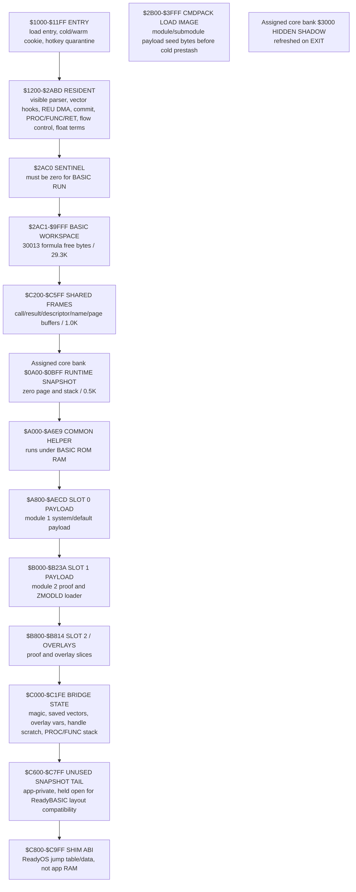
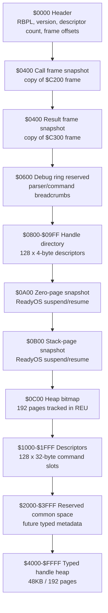
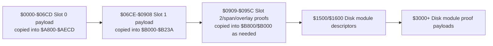
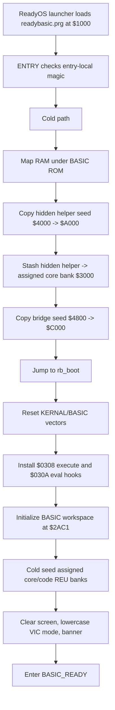
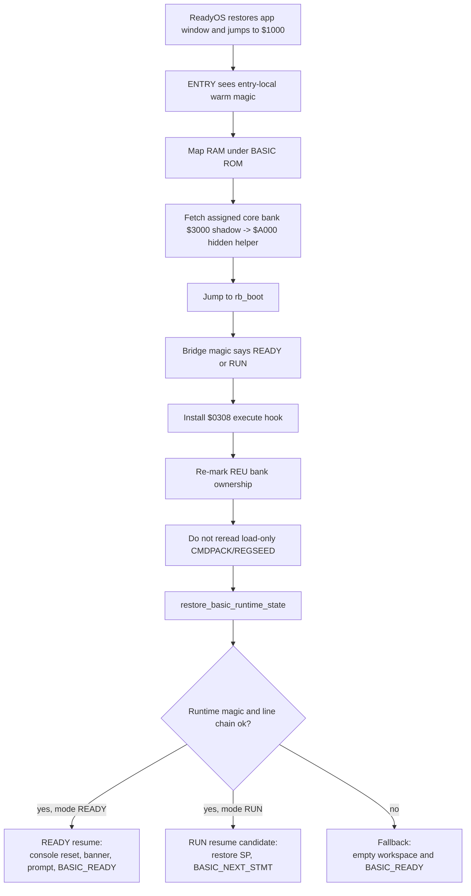
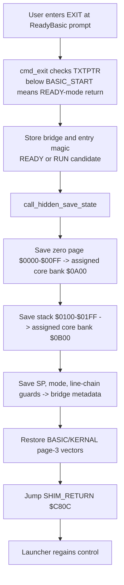
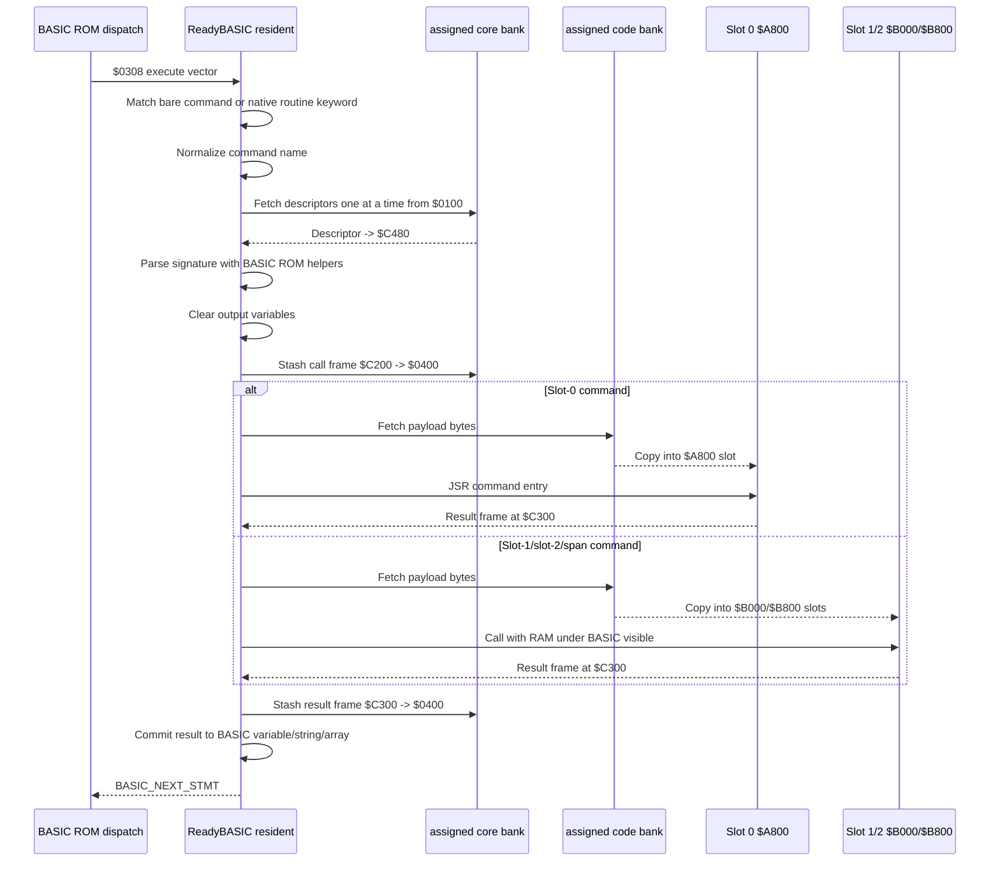
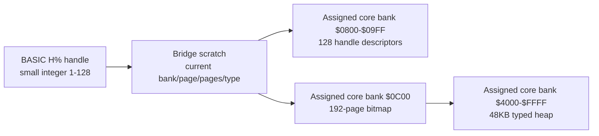

# ReadyBASIC Lifecycle And REU Architecture Deep Dive

This document describes the current ReadyBASIC REU plugin spine as implemented
in `src/apps/readybasic/readybasic.s` and linked by
`cfg/ready_app_readybasic.cfg`. It focuses on lifespan management: initial
loading, cold setup, command dispatch, REU prestash, overlay execution, result
commit, `EXIT`, and warm suspend/resume.

Current evidence base:

- `src/apps/readybasic/readybasic.s`
- `cfg/ready_app_readybasic.cfg`
- `obj/readybasic.map`
- `src/apps/readybasic/READYBASIC_PLUGIN_ARCH.md`
- `src/apps/readybasic/READYBASIC_PLUGIN_PROGRESS.md`
- `src/apps/readybasic/readybasiclessonslearnt.md`
- `src/apps/readybasic/READYBASIC_MICROMODULE_SYNC.md`

The generated special report `docs/readybasic_memory_diagrams.html` is the
preferred visual companion for this document. Regenerate it with
`make readybasic-memory-report` after ReadyBASIC memory/layout changes; it
renders the same current lifecycle facts as proportional C64 RAM and REU maps.

## Executive Summary

ReadyBASIC is a ReadyOS app that hosts a relocated C64 BASIC workspace and adds
bare `COMMAND(...)` statements, selected `COMMAND(...)` expressions, and native
`PROC`/`FUNC` routines, plus resident `REPEAT`/`UNTIL` and `LABEL`/`JUMP`
flow control. It is not currently a custom BASIC token system. Stored
lines preserve readable command and routine text, and the wedge recognizes the
extensions when BASIC dispatches statements through `$0308` or expressions
through `$030A`. A tiny crunch hook delegates to ROM crunch first, then rewrites
real `THEN EXEC ...` and `THEN JUMP ...` cases as colon-prefixed statements so
the normal statement dispatcher is used. Descriptor-backed command statements
after `THEN` should write the colon explicitly.

The design is deliberately lean:

- All ReadyBASIC-specific code is assembler.
- The visible resident core is the only code that calls BASIC ROM helpers.
- Command implementations are packed in the assigned ReadyBASIC code bank and
  copied into a small overlay slot only when needed.
- Registry, call-frame, result-frame, handle metadata, and persistent sample
  heap state live in the assigned ReadyBASIC core bank.
- BASIC string heap mutation happens only in visible resident code after a
  command succeeds.
- Hidden `$A000` code is used only when the CPU banking contract is explicit and
  restored immediately afterward.

The pre-module map confirmed this layout; the module/submodule update follows
immediately after it so the historical measurements remain available without
being mistaken for the latest slot layout:

| Segment | Runtime range | Size | Role |
|---|---:|---:|---|
| `ENTRY` | `$1000-$11FF` | `$0200` (512B) | App entry, cold/warm discriminator, early copies, and small visible trampolines. |
| `RESIDENT` | `$1200-$2ABD` | `$18BE` (6.2K, 6334 exact bytes) | Visible parser, ROM calls, REU DMA wrappers, result commit, bare command dispatch, eval hook, native `PROC`/`FUNC`/`RET`, `REPEAT`/`UNTIL`, `LABEL`/`JUMP`, error introspection, proper nested term state, float helpers, and prompt navigation hooks. |
| `REGSEED` | `$5000-$600F` | `$1010` (4.0K, 4112 exact bytes) | Load-only registry header and 128 command descriptors used on cold seed. |
| `HIDDEN` | `$A000-$A6E9` | `$06EA` (1.7K, 1770 exact bytes) | Hidden helper routines under BASIC ROM. |
| `LOWPACK` | `$A800-$AECD` | `$06CE` (1.7K, 1742 exact bytes) | Banked low overlay image under BASIC ROM, loaded from the assigned ReadyBASIC code bank. |
| `BRIDGE` | `$C000-$C1FE` | `$01FF` (511B) | Persistent bridge/state bytes plus the four-entry native routine return stack and flow-control scratch. |

Module/submodule update: the table above is preserved as the detailed
pre-module plugin-spine snapshot. The current post-BASIC runtime map is:

| Range | Owner after init | Current meaning |
|---|---|---|
| `$0000-$00FF` | C64/BASIC/KERNAL zero page | Saved to assigned core bank offset `$0A00` on suspend/resume. |
| `$0100-$01FF` | Hardware stack | Saved to assigned core bank offset `$0B00`. |
| `$0200-$03FF` | BASIC/KERNAL vectors and buffers | ReadyBASIC hooks execute/eval plus KEYLOG and CHRIN while active. |
| `$0400-$07E7` | Screen RAM | Can be captured by `SCRCAP`. |
| `$0800-$0FFF` | Low BASIC/system RAM | Outside ReadyBASIC app-owned region. |
| `$1000-$11FF` | ReadyBASIC entry | Cold/warm discriminator, handoff, hotkey quarantine, and small visible trampolines. |
| `$1200-$2ABD` | ReadyBASIC resident | Parser, ROM calls, dispatch, commit, native language runtime. |
| `$2AC0` | Sentinel | Must remain zero before stored-program `RUN`. |
| `$2AC1-$9FFF` | BASIC workspace | Program text, variables, arrays, strings, and reclaimed seed space. |
| `$A000-$A7FF` | RAM behind BASIC ROM | Common helper, current use `$A000-$A6E9`; `$0116` / 278B remain free. |
| `$A800-$AFFF` | RAM behind BASIC ROM | Submodule slot 0, current module 1/system payload. |
| `$B000-$B7FF` | RAM behind BASIC ROM | Submodule slot 1, current module 2 proof/loader payload. |
| `$B800-$BFFF` | RAM behind BASIC ROM | Submodule slot 2 and overlay target. |
| `$C000-$C1FE` | ReadyBASIC bridge | Small state below shared frames. |
| `$C200-$C5FF` | ReadyBASIC frames/buffers | Call frame, result frame, descriptor/name/page buffers, disk-module load page. |
| `$C600-$C7FF` | App-private snapshot tail | Intentionally unused so the custom ReadyBASIC assembler/linker shape remains stable. |
| `$C800-$C9FF` | ReadyOS shim ABI | Not ReadyBASIC scratch. |
| `$D000-$DFFF` | I/O or character ROM | REU registers are in I/O space. |
| `$E000-$FFFF` | KERNAL ROM normally visible | KERNAL calls remain available after normal banking is restored. |

Current measured values are `BASIC_START=$2AC1`, `RESIDENT=$18BE`,
`BRIDGE=$01FF`, common helper `$06EA`, slot 0 `$06CE`, slot 1 `$023B`, and
formula empty BASIC free bytes `30013`.

The older low/hidden command overlay vocabulary is now implemented as a
module-aware under-ROM command system. Descriptors remain 32 bytes, but their
fields now identify module id, submodule id, overlay id, slot mask, assigned
code-bank payload offset/size, runtime destination, entry offset, signature id,
and name. Assigned core-bank offsets `$2000-$3FFF` are reserved for the richer per-slot residency
catalog; the current proof keeps only a tiny last-command/copy-count record in
bridge RAM.

## Technical Philosophy

ReadyBASIC treats BASIC as a live ROM interpreter with fragile state, not as a
stateless command shell. The main rule is that **BASIC-facing work happens in
visible resident RAM, and worker code stays dumb**.

That rule has several consequences:

- Parameter parsing uses BASIC ROM helpers from visible RAM:
  - `CHKCOM`
  - `FRMNUM`
  - `GETADR`
  - `PTRGET`
- Output variable references are captured before command execution.
- Output variables are cleared before command execution so failure does not show
  stale data.
- Overlays write only a compact result frame.
- The resident core commits results after success, including string heap writes.
- Hidden workers do not allocate BASIC strings.
- REU stores code and metadata, but the live BASIC interpreter state remains in
  C64 RAM and is protected by the ReadyBASIC suspend/resume snapshot.

The V1 spine intentionally avoids a few attractive but expensive abstractions:

- No generic object/value VM.
- No nested value serialization.
- No per-command REU bank.
- No command-per-bank storage.
- No private command token or custom lister yet.
- Only tiny post-ROM-crunch `THEN EXEC ...` and `THEN JUMP ...` normalizers are
  installed.
- No generalized signature bytecode interpreter yet; signatures are dispatched
  by compact hand-written routines.

## Full RAM Layout

The ReadyOS app working region is `$1000-$C7FF`; `$C600-$C7FF` is app-private
but intentionally unused by ReadyBASIC, and `$C800-$C9FF` is shim ABI territory.
ReadyBASIC must preserve its custom assembler/linker shape while hosting BASIC.



### Load Image Versus Runtime Image

The PRG load address is `$1000`. The linker emits a larger load image than the
runtime-visible resident core:

| Load-time range | Purpose |
|---:|---|
| `$1000-$11FF` | Entry image, including entry-local warm cookie. |
| `$1200-$2ABF` | Resident core image budget. Current linked core ends at `$2AB8`. |
| `$2AC0-$2AFF` | Sentinel plus cold padding gap before command-pack seed bytes. |
| `$2B00-$3FFF` | Command pack seed bytes, copied to the assigned code bank only on cold entry. |
| `$4000+` | Hidden helper seed bytes, copied to `$A000` and stashed to assigned core-bank offset `$3000`. |
| `$4800+` | Bridge seed bytes, copied to `$C000`. |
| `$5000-$600F` | Registry seed bytes, copied to the assigned core bank only on cold entry. |

After cold setup, BASIC owns `$2AC1-$9FFF`. This is why warm resume must **not**
try to reread the load-only seed tables at `$2B00+`, `$4000+`, `$4800+`, or
`$5000+`: that memory may now be BASIC program or variable storage.

### Cold-Load Versus Steady-State Ownership

ReadyBASIC has two different memory pictures that must not be merged:

| Stage | What is in C64 RAM | What counts against BASIC free bytes |
|---|---|---|
| ReadyOS load | The PRG load image includes `CMDPACK` at `$2B00-$3FFF`, `HIDLOAD` at `$4000+`, `BRLOAD` at `$4800+`, and `REGSEED` at `$5000-$600F`. | Nothing user-visible yet; BASIC has not been handed `$2AC1-$9FFF`. |
| Cold seed | Hidden helper code copies the registry/header to the assigned core bank, copies packed command code to the assigned code bank, and copies live hidden/bridge code to `$A000/$C000`. | The load-only ranges are still temporary seed bytes. |
| Ready prompt | BASIC owns `$2AC1-$9FFF`, including the former load-image addresses. `CMDPACK`, `HIDLOAD`, `BRLOAD`, and `REGSEED` must be treated as gone. | Empty BASIC free bytes are `30013` formula bytes. |
| Command execution | Packed command code is fetched from the assigned code bank into the `$A800`, `$B000`, and/or `$B800` submodule slots behind BASIC ROM, then control returns to resident commit code. | No per-command BASIC workspace loss. |

`CMDPACK` is therefore both visually inside the BASIC address span and
steady-state free. The current reservation is `$1500` (5.25K); the implemented
built-in module/submodule payload content is `$085C` / 2.1K. That reserved
command-pack area currently has `$0CA4` / 3.2K of unused seed room and can grow
during cold load without changing `BASIC_START`, `BASIC_LIMIT`, or the `30013`
empty BASIC free-byte measurement, because it is prestashed to REU before BASIC
owns the range.

There are two separate limits:

| Layer | Current size | What it means |
|---|---:|---|
| C64 `CMDPACK` cold-load window | `$1500` / 5.25K | The linker currently places the initial packed command seed bytes at `$2B00-$3FFF` before cold setup copies them out. This is a seed window, not the architectural command-code ceiling. |
| Assigned command-code bank | `$10000` / 64.0K | The current descriptor format uses 16-bit offsets/sizes into this bank, so one code bank can address up to 64K of packed command bodies. Built-in payloads currently occupy `$0000-$085B`; disk-module proof descriptors/payloads currently use `$1500`, `$1600`, `$3000`, `$3200`, `$3300`, and `$3400`. Native `PROC`/`FUNC` definitions and resident flow-control markers are BASIC text and do not use this bank. |
| Beyond one code bank | More than 64K | Requires a descriptor/loader extension for additional code banks or a bank-selection field. That is future architecture, not the current single-bank ABI. |

So, with the current descriptor and REU command-code architecture, packed command
code can grow to one 64K REU code bank. The current PRG/load linker only seeds a
5.25K `CMDPACK` window today; filling more of the assigned code bank would require expanding
or adding cold-load seed windows and copying them before BASIC owns the memory.
That kind of seed expansion should still be reclaimed and should not reduce
steady-state BASIC free bytes.

The generated proportional HTML report uses these exact current subranges inside
the raw `$2AC0-$9FFF` cold-load span:

| Subrange | Cold-load role | Hex size | Display size | Exact bytes |
|---|---|---:|---:|---:|
| `$2AC0-$2AFF` | Sentinel and padding before `CMDPACK`. | `$0040` | 64B | 64 |
| `$2B00-$3FFF` | `CMDPACK` reserved cold-load image. | `$1500` | 5.25K | 5376 |
| `$4000-$4364` | `HIDLOAD` seed. | `$0365` | 0.8K | 869 |
| `$4365-$47FF` | Padding / future BASIC after cold seed. | `$049B` | 1.2K | 1179 |
| `$4800-$49F6` | `BRLOAD` seed. | `$01F7` | 503B | 503 |
| `$49F7-$4FFF` | Padding / future BASIC after cold seed. | `$0609` | 1.5K | 1545 |
| `$5000-$600F` | `REGSEED` header plus 128 descriptors. | `$1010` | 4.0K | 4112 |
| `$6010-$61FF` | `REGSEED` reserved tail. | `$01F0` | 496B | 496 |
| `$6200-$9FFF` | Future BASIC bytes after `REGSEED`. | `$3E00` | 15.5K | 15872 |

Inside `CMDPACK`, the current packed built-in content is slot 0 payload
`$2B00-$31CD` (`$06CE`, 1742B), slot 1 payload `$31CE-$3408`
(`$023B`, 571B), slot 2 base payload `$3409-$341D` (`$0015`, 21B), span
payload `$341E-$3432` (`$0015`, 21B), overlay 1 `$3433-$3447`
(`$0015`, 21B), overlay 2 `$3448-$345C` (`$0015`, 21B), and reserved room
`$345D-$3FFF` (`$0BA3`, 2.9K, 2979 exact bytes).

## REU Layout

ReadyBASIC uses two launcher-assigned REU resource banks:

- Core bank: ReadyBASIC common/system storage.
- Code bank: packed command-code storage.

The mirrored ReadyOS type constants are:

| Type | Value | Meaning |
|---|---:|---|
| `REU_RB_CORE` | `14` | ReadyBASIC core/system bank. |
| `REU_RB_CODE` | `15` | ReadyBASIC packed command-code bank. |

ReadyBASIC resolves the physical bank ids at startup from loader-published
metadata and marks those assigned banks in the ReadyOS REU allocation table. It
does not treat `$C600` as general app scratch and must not assume fixed
physical `$44/$45` banks.

### Assigned Core Bank: Common/System Bank



Exact assigned core-bank suballocation sizes:

| Offset range | Role | Hex size | Display size | Exact bytes |
|---|---|---:|---:|---:|
| `$0000-$000F` | Header. | `$0010` | 16B | 16 |
| `$0010-$03FF` | Reserved common/system metadata space before frames. | `$03F0` | 1.0K | 1008 |
| `$0400-$04FF` | Call frame snapshot. | `$0100` | 256B | 256 |
| `$0400-$05FF` | Result frame snapshot. | `$0100` | 256B | 256 |
| `$0600-$07FF` | Reserved REU debug ring. | `$0200` | 0.5K | 512 |
| `$0800-$09FF` | 128-handle directory, 4 bytes per descriptor. | `$0200` | 0.5K | 512 |
| `$0A00-$0AFF` | Zero-page snapshot. | `$0100` | 256B | 256 |
| `$0B00-$0BFF` | Stack-page snapshot. | `$0100` | 256B | 256 |
| `$0C00-$0FFF` | Heap bitmap page; 192B used, remainder reserved. | `$0400` | 1.0K | 1024 |
| `$1000-$1FFF` | 128 command descriptors, 32 bytes each. | `$1000` | 4.0K | 4096 |
| `$2000-$3FFF` | Reserved common/system expansion space. | `$2000` | 8.0K | 8192 |
| `$4000-$FFFF` | Typed handle heap, 192 pages. | `$C000` | 48.0K | 49152 |

The command descriptor table at `$1000-$1FFF` is intentionally sparse:

| Descriptor range | REU offset | Role | Slots | Size |
|---|---:|---|---:|---:|
| Slots 1-16 | `$1000-$11FF` | Current front commands from `ZECHO1` through `FADD`. | 16 | `$0200` / 512B |
| Slots 17-127 | `$1200-$1FDF` | Zero-filled filler descriptors reserved for future commands. | 111 | `$0DE0` / 3.5K / 3552 exact bytes |
| Slot 128 | `$1FE0-$1FFF` | `SCRPUT`, placed at the end to prove full-table lookup. | 1 | `$0020` / 32B |

`SCRCAP` is adjacent to the current front command set in slot 14, with `FADD`
in slot 16. `SCRPUT` is separated from it by 111 empty filler slots, so the
visual/test coverage proves
that ReadyBASIC fetches descriptor pages and scans the whole 128-slot registry.

Persistent buffers use the typed heap in the assigned core bank, pages `$40-$FF`. Each
handle records a bank, starting page, page count, and type in the REU-backed
directory. The page bitmap is also canonical in REU, so resident/bridge RAM only
needs the current descriptor scratch and a 256-byte page buffer. Type `1` is a
byte buffer, and type `2` is a screen text+color buffer.

### Assigned Code Bank: Packed Command-Code Bank



The descriptor stores payload offsets, sizes, slot masks, runtime destinations,
and entry offsets inside the assigned code bank. Small proof commands can copy tiny slices.
Heap commands currently copy the whole slot-0 payload because their wrappers
call shared allocator helper routines in the same module payload.

Exact assigned code-bank suballocation sizes:

| Offset range | Role | Hex size | Display size | Exact bytes |
|---|---|---:|---:|---:|
| `$0000-$06CD` | Built-in module 1 slot-0 payload fetched into `$A800-$AECD`. | `$06CE` | 1.7K | 1742 |
| `$06CE-$0908` | Built-in module 2 slot-1 proof and streaming `ZMODLD` loader payload fetched into `$B000-$B23A`. | `$023B` | 571B | 571 |
| `$0909-$095C` | Built-in slot-2, span, and overlay proof slices. | `$0054` | 84B | 84 |
| `$095D-$14FF` | Free gap before current disk-module descriptor proof offsets. | `$0BA3` | 2.9K | 2979 |
| `$1500-$151F` | `rbm.sample1` descriptor proof for `ZDM1`. | `$0020` | 32B | 32 |
| `$1600-$165F` | `rbm.sample2` descriptors for `ZDM2S`, `ZDOV1`, and `ZDOV2`; submodule 5 appears twice because those entries are overlays 1 and 2. | `$0060` | 96B | 96 |
| `$1700-$1ABF` | `rbm.sample3` descriptors for `ZSAA`-`ZUEB`. | `$03C0` | 960B | 960 |
| `$3000-$3014`, `$3200-$3214`, `$3300-$3314`, `$3400-$3414` | Small disk-module proof payloads. | `$0015` each | 21B each | 21 each |
| `$3800-$463C` | `rbm.sample3` payload records for `ZSAA`-`ZUEB`, stored on `$100`-byte strides. | `$003D` per overlay image | 61B per overlay image | 61 each |

## Descriptor ABI

Each command descriptor is 32 bytes:

| Offset | Field |
|---:|---|
| `0` | Command id. |
| `1` | Module id. |
| `2-3` | Payload offset in the assigned code bank. |
| `4-5` | Payload size. |
| `6` | Submodule id. |
| `7` | Overlay id, or `0` for a base submodule. |
| `8` | Slot mask: bit 0 = `$A800`, bit 1 = `$B000`, bit 2 = `$B800`. |
| `9` | Generation/check byte. |
| `10-11` | Runtime destination offset from `$A000`. |
| `12-13` | Entry offset inside the loaded payload. |
| `14` | Signature id. |
| `15` | Uppercase command-name length. |
| `16-31` | Uppercase command-name bytes, zero padded. |

The current descriptors are seeded from `REGSEED` during cold boot and copied
to the assigned core bank at offset `$1000`. Lookup fetches 256-byte pages, scans eight
descriptors per page, and treats zero-filled filler descriptors as empty slots.

## Cold Boot Lifecycle



The cold setup performs these important operations:

1. It copies hidden helper code before BASIC owns `$2AC1+`.
2. It stores a REU shadow copy at assigned core-bank offset `$3000` because
   `$A000` code cannot be trusted after a ReadyOS app switch.
3. It copies bridge state to `$C000`.
4. It resets KERNAL and BASIC vectors, then installs the execute vector hook at
   `$0308/$0309` and the eval hook at `$030A/$030B`.
5. It relocates BASIC:
   - `TXTTAB = $2AC1`
   - `VARTAB = ARYTAB = STREND = $2AC3`
   - `FRETOP = MEMSIZ = $A000`
   - KERNAL memory bottom/top = `$2AC0/$A000`
6. It clears `$2AC0`, `$2AC1`, and `$2AC2`. The `$2AC0` byte is a hard
   invariant: C64 BASIC `RUN` expects the byte before `TXTTAB` to be zero.
7. It seeds the assigned ReadyBASIC core and code banks.
8. It draws the ReadyBASIC banner and enters `BASIC_READY`.

## Warm Resume Lifecycle



Warm resume is intentionally different from cold boot:

- It restores the hidden helper from the assigned core-bank `$3000` shadow, not from the old load image.
- It reinstalls ReadyBASIC-owned vectors.
- It re-marks REU ownership for the assigned ReadyBASIC core/code banks.
- It does **not** rebuild the registry/code banks from load-only RAM.
- It restores BASIC stack and zero page from assigned core-bank offsets `$0A00/$0B00`.
- It resets KERNAL memory bounds, but it does not reset live BASIC pointers such
  as `FRETOP`, `VARTAB`, `ARYTAB`, or `STREND`.
- READY-mode resume clears/redraws the screen so the launcher menu does not
  remain visible underneath a BASIC prompt.

## EXIT And Suspend Management

The supported prompt navigation paths are manual prompt `EXIT`, prompt-level
`CTRL+B`, and prompt-level `F2`/`F4`. The execute hook detects `EXIT` before
falling back to ROM BASIC. Prompt hotkeys are detected by the KEYLOG
preprocessing hook at `$028F/$0290` only after ReadyBASIC's IMAIN hook at
`$0302/$0303` has marked the direct prompt active and input is coming from the
keyboard. The execute hook clears that prompt-active flag before direct commands
and stored program lines run. This avoids relying solely on `CURLIN`/`TXTPTR`,
which can still describe the just-run program after BASIC has visibly returned
to `READY.`. KEYLOG records the pending action, consumes the decoded key state,
and queues only Return. The CHRIN hook discards the editor-returned character
and dispatches the pending action before BASIC can store or execute a partial
prompt line. Ordinary line editing, key repeat, cursor state, and space handling
stay owned by the ROM screen editor.



`F2`/`F4` perform the same save/vector-restore setup, then scan authoritative
schema-v5 loaded flags at ReadyOS-bank offset `$BA40 + token`, copy the selected
target token into bridge state, and
only write `$C820` after hidden save, `CLRCHN`, and vector restore have
completed. This keeps the switch target independent of scratch bytes used by
the loaded-bank scan. If no other loaded app is available, the key is consumed
and the BASIC editor keeps waiting.

The vector restore is not optional. Page-3 vectors are global machine state, not
ReadyOS app-private RAM. If ReadyBASIC yielded with `$0308` still pointing into
its resident core, the launcher or another app could dispatch through stale
ReadyBASIC state.

ReadyBASIC also clears its pending hotkey byte, the KERNAL keyboard buffer
count, the first keyboard-buffer byte, `SHFLAG`, `LSTX`, and `SFDX` before every
ReadyOS yield. `prepare_shim_yield` calls `CLRCHN` so destination apps do not
inherit an open BASIC logical channel from the ROM editor.

The hotkey release contract is deliberately stronger than simple state clear.
On cold and warm entry, ReadyBASIC scans the physical CIA1 matrix and quarantines
any still-held `CTRL+B`, `F2`, or `F4` chord until it is released. Before
yielding for a prompt hotkey, it waits for that exact selected chord to release
with a jiffy-clock timeout, then clears the editor/KERNAL key state again. This
prevents a single F-key press from being consumed once by ReadyBASIC and again
by the destination app after the ReadyOS switch.

The runtime snapshot lives here:

| Range | Meaning |
|---:|---|
| Assigned core bank `$0A00-$0AFF` | Saved zero page. |
| Assigned core bank `$0B00-$0BFF` | Saved hardware stack page. |
| Bridge metadata | Runtime magic, saved SP, resume mode, line-chain validation. |
| Assigned core bank `$3000+` | Hidden helper shadow, refreshed during `EXIT` and cold seed. |

## Bare Command And Routine Dispatch

ReadyBASIC installs the BASIC crunch, execute, and eval vectors:

- Save originals from `$0304-$030B`.
- Install `rb_crunch` into `$0304/$0305`.
- Install `rb_execute` into `$0308/$0309`.
- Install the expression hook into `$030A/$030B`.
- Leave the list vector forwarding to ROM behavior for V1.

The dispatch rule is:

1. Crunch delegates to ROM BASIC, then inserts `:` before known
   `COMMAND(...)` calls or `EXEC` only after a tokenized `THEN`.
2. Execute peeks at the next non-space byte without advancing `TXTPTR`.
3. If it is not `EXIT`, a native routine keyword, or a known command name
   followed by `(`, tail-call the saved ROM execute vector.
4. Bare commands parse a ReadyBASIC command name, require parentheses, and use
   the descriptor/signature path.
5. `PROC`, `FUNC`, `EXEC`, `RET`, and `ENDP` use the native routine path.
6. If it is `EXIT`, take the ReadyOS yield path.

This is why `LIST` still shows readable command/routine text: there is no
private token to hide or pretty-print.

The command name parser normalizes:

- Host/lowercase ASCII command bytes to uppercase.
- Shifted uppercase/PETSCII-like `$C1-$DA` bytes by subtracting `$80`.
- A couple of BASIC token bytes (`FN`, `FRE`) if ROM tokenization produces them
  inside a name.

That last detail exists because ASCII/lowercase/PETSCII/tokenized BASIC input
is a real source of C64 wedge bugs.

## Command Execution Pipeline



### Shared Frames In Low RAM

| Frame | Address | Contents |
|---|---:|---|
| Call frame | `$C200` | Command id, parameter count, numeric slots, pointer/count slots, string buffer. |
| Result frame | `$C300` | Status, error, value tag, scalar value, string buffer, array buffer. |
| Descriptor buffer | `$C480` | One 32-byte descriptor fetched from the assigned core bank. |
| Command buffer | `$C4A0` | Normalized command name. |
| Page buffer | `$C500` | 256-byte descriptor/bitmap page buffer for handle operations and warm-resume stack staging. |

The call and result frames are also mirrored to assigned core-bank offsets `$0400`
and `$0400`. This gives crash/debug visibility and gives future worker models a
stable mailbox shape.

## Parameter And Result Semantics

V1 supports the sample command signatures directly:

| Input kind | Implementation rule |
|---|---|
| Integer numeric expression | `CHKCOM`, `FRMNUM`, `GETADR`; stores 16-bit value from `LINNUM`. |
| Plain numeric expression | `CHKCOM`, `FRMNUM`; preserves BASIC's five-byte float value for float signatures. |
| Integer output variable | `PTRGET`, require numeric/integer, clear two bytes before execution. |
| String input | String variable descriptor or quoted literal, max 64 bytes copied to call frame. |
| String output variable | `PTRGET`, require string, clear descriptor before execution. |
| Integer array input | Require explicit base element and count, e.g. `A%(0),N`. |
| Integer array output | Require explicit base element and count from prior argument. Clears destination first. |
| REU handle | V1 handle is represented as an integer variable/value. |

Result tags are:

| Tag | Meaning |
|---:|---|
| `0` | none |
| `1` | integer |
| `2` | string |
| `3` | integer array |
| `4` | float |

If `RF_STATUS` is nonzero, ReadyBASIC prints `?RB ERROR n` and returns to
`BASIC_READY`. On a clean result, resident code commits to the captured output
reference.

String output is special: overlays stage bytes into `RF_STR_BUF`, then resident
code allocates from the BASIC string heap by lowering `FRETOP`. This is the
correct side of the contract because only resident visible code should mutate
BASIC's string heap.

## Command Inventory

| Command | Code placement | REU code bytes copied | Parameters | Result behavior |
|---|---|---:|---|---|
| `ZECHO1(OUT%)` / `ZECHO1()` | Resident-precomputed result; legacy low stub remains in `LOWPACK` | 0 copied on current path | output int or expression int | Returns `1`. |
| `ZADD16(A,B,OUT%)` / `ZADD16(A,B)` | Module 1 slot 0 payload | small slice | two numeric expressions, output or expression int | Returns 16-bit sum. |
| `FADD(A,B,OUT)` / `FADD(A,B)` | Resident-computed float demo; descriptor slot 16 has a one-byte low stub | `$0001` stub if fetched | two plain numeric expressions, output/expression float | Uses BASIC ROM floating addition. |
| `ZPAUSE(TICKS)` | Module 1 slot 0 payload | small slice | tick count | Waits for the requested jiffy count. |
| `UPPER(S$,OUT$)` / `UPPER(S$)` | Module 1 slot 0 payload | small slice | string variable or literal, output/expression string | Uppercases staged bytes. |
| `LOWER(S$,OUT$)` / `LOWER(S$)` | Module 1 slot 0 payload | small slice | string variable or literal, output/expression string | Lowercases staged byte values; tests assert `ASC()` bytes because C64 display case is charset-dependent. |
| `ZHIDDENRAM(S$,OUT%)` / `ZHIDDENRAM(S$)` | Module 1 slot 0 under-ROM worker | small slice | string variable or literal, output/expression int | Sums uppercase bytes. |
| `ZSUMNUMARRAY(A%(0),COUNT,OUT%)` / `ZSUMNUMARRAY(A%(0),COUNT)` | Module 1 slot 0 payload | small slice | integer array base/count, output/expression int | Sums integer array values. |
| `ZRANGENUMARRAY(START,COUNT,A%(0))` | Module 1 slot 0 payload | small slice | start/count, output array | Stages consecutive integers. |
| `BUFMAKE(LEN,H%)` / `BUFMAKE(LEN)` | Module 1 slot 0 payload | `$06CE` (1.7K) | length, output/expression handle | Allocates persistent buffer pages in the assigned core bank. |
| `BUFFILL(H%,BYTE)` | Module 1 slot 0 payload | `$06CE` (1.7K) | buffer handle, byte | Fills buffer handle pages using `$C500` page buffer. |
| `BUFDROP(H%)` | Module 1 slot 0 payload | `$06CE` (1.7K) | handle | Frees any valid handle type and clears metadata. |
| `ZTEMPSCRATCH(LEN,OUT%)` / `ZTEMPSCRATCH(LEN)` | Module 1 slot 0 payload | `$06CE` (1.7K) | length, output/expression int | Allocates then frees pages, returns page count. |
| `ZFAIL(CODE,OUT%)` | Module 1 slot 0 payload | small slice | code, output int | Clears output first, then returns `?RB ERROR code`. |
| `MEMAVL()` | Module 1 slot 0 payload | small slice | none | Prints live free BASIC bytes. |
| `SCRCAP(H%)` / `SCRCAP()` | Slot 14; module 1 slot 0 payload | `$06CE` (1.7K) | output/expression screen handle | Captures screen text and color RAM into a type-2 handle. |
| `ERRCODE(OUT%)` / `ERRCODE()` | Resident-precomputed result; legacy low stub remains in `LOWPACK` | 0 copied on current path | output int or expression int | Returns the last ReadyBASIC runtime error code. |
| `ERRLINE(OUT%)` / `ERRLINE()` | Resident-precomputed result; legacy low stub remains in `LOWPACK` | 0 copied on current path | output int or expression int | Returns the last ReadyBASIC runtime error line, or 0 in direct mode. |
| `SCRPUT(H%)` | Slot 128; module 1 slot 0 payload | `$06CE` (1.7K) | screen handle | Restores screen text and color RAM after type validation. |

The heap-oriented commands copy the full `$06CE` slot-0 payload because allocator,
REU descriptor, bitmap, and screen-copy helpers live in the same module payload.
That is an implementation choice to keep resident RAM lean; a later pass could
split a smaller allocator resident helper or use finer overlay slices.

## Persistent Handle Model

ReadyBASIC supports up to 128 live handles and a 48KB typed heap.



`BUFMAKE` converts byte length to 256-byte pages, finds contiguous free pages,
records type-1 metadata, and returns a one-based handle. `BUFFILL` accepts only
type-1 buffer handles, fills `$C500` with the byte, and stashes it page by page
into the assigned core bank at page offsets `$40-$FF`. `SCRCAP` creates a type-2 handle and
stashes screen text plus color RAM; `SCRPUT` validates type `2` before restore.
`BUFDROP` clears both the handle descriptor and bitmap for any valid handle type.
`ZTEMPSCRATCH` proves temporary allocation by finding pages without persisting a
live descriptor.

This handle model is the right direction for future commands that maintain
screen buffers, network buffers, caches, or large results. The current fixed
core-bank heap is intentionally typed and compact; larger future resources can add
extra banks while keeping the same small BASIC-visible handle.

## Hidden Code And Banking Contract

ReadyBASIC uses two kinds of hidden code:

- Hidden helper at `$A000-$A6C7`.
- Command/module payload slots at `$A800-$BFFF`.

Before calling hidden code, ReadyBASIC:

1. Saves flags.
2. Disables interrupts.
3. Forces the low CPU data-direction bits in `$0000` to outputs.
4. Saves `$0001`.
5. Maps RAM under BASIC ROM while keeping KERNAL visible.
6. Performs the copy or call.
7. Restores `$0001`.
8. Restores flags.

That discipline matters because `$0001` is only meaningful when `$0000` drives
the banking bits as outputs. It also matters because hidden code that still uses
KERNAL-visible helpers must not map KERNAL out.

## What Must Stay True

These invariants are the current safety rails:

- ReadyBASIC must be booted through normal ReadyOS profile/run flow, not as a
  standalone app.
- In the current repeat/label/error-introspection design, `BASIC_START` stays `$2AC1`.

## Current Repeat/Label Delta

The current design moves the live BASIC workspace to `$2AC1-$9FFF` so
`REPEAT`/`UNTIL`, `LABEL`/`JUMP`, and `ERRCODE`/`ERRLINE` can fit on top of the
proper nested expression and float-term work.
The sections above have been updated to the current repeat/label layout;
older dated measurements remain in `READYBASIC_PLUGIN_PROGRESS.md`.

| Segment | Range | Size |
|---|---:|---:|
| `ENTRY` | `$1000-$11FF` | `$0200` / 512B |
| `RESIDENT` | `$1200-$2ABD` | `$18BE` / 6334B |
| `PADLOW` | `$2AC0-$2AFF` | `$0040` / 64B |
| `REGSEED` | `$5000-$600F` | `$1010` / 4112B |
| `HIDDEN` | `$A000-$A6E9` | `$06EA` / 1770B |
| `LOWPACK` | `$A800-$AECD` | `$06CE` / 1742B |
| `SLOTPACK1` | `$B000-$B23A` | `$023B` / 571B |
| `SLOTPACK2` | `$B800-$B814` | `$0015` / 21B |
| `BRIDGE` | `$C000-$C1FE` | `$01FF` / 511B |

Formula empty BASIC free bytes are `30013`, a `1728` byte reduction from the
expression-style `$2401` layout. Command overlays grow to `$063D` and the REU
descriptor layout remains fixed.
- `$2AC0` stays zero before stored-program `RUN`.
- `RESIDENT` stays below `$2AC0`.
- `BRIDGE` stays below `$C200`, leaving `$C200-$C5FF` for shared frames.
- `$C600-$C7FF` is app-private snapshot RAM but remains unused by the current
  ReadyBASIC assembler/linker contract.
- `$C800-$C9FF` remains shim ABI.
- Warm resume must restore `$A000` from the assigned-core-bank hidden-helper shadow before hidden helper calls.
- Warm resume must not reset `FRETOP`, `VARTAB`, `ARYTAB`, or `STREND`.
- ReadyBASIC-owned vectors must be restored before yielding to ReadyOS.
- Non-ReadyBASIC BASIC statements must tail-call the original `$0308` vector
  without mutated `TXTPTR`.
- String heap writes happen only in resident visible code.
- Acceptance re-entry uses launcher menu navigation, not `CTRL+3`.

## Current Verification

The current full visual suite is:

```sh
READYBASIC_VISIBLE=1 build_support/run_readybasic_full_suite_visual_verification.sh
```

Latest documented pass on the REU-backed 128-handle path:

- Run dir:
  `../agenticdevharness/logs/vice_auto_20260522_154424`
- Result: 133/133 concrete steps, `FailedStep: null`, no degraded steps; the
  wrapper reports `partial`, matching the current no-failed-step harness
  behavior.
- It validates:
  - Cold ReadyOS boot with `READYOS_CONFIG_RUN_FIRST=readybasic`.
  - Direct-mode scalar, string, hidden worker, array, REU handle, temp heap,
    128-handle edge, 48KB heap edge, screen heap exhaustion, failure, and
    unknown-command paths.
  - Menu-based launcher round trip and ReadyBasic redraw.
  - BASIC variable/string state plus registry survival after resume.
  - Stored-program `LIST` and `RUN` for the major command families.

## Design Notes For Future Expansion

The current architecture can scale to many commands if the command registry and
code pack remain compact:

- Keep command code packed inside banks, not one bank per command.
- Keep descriptors fixed-size for v1.
- Move large command-private state to dynamic REU banks referenced by small
  BASIC integer handles.
- Consider moving reusable allocator helpers into a separate resident or common
  overlay only if it reduces total copied bytes without bloating resident RAM.
- Add a real crunch/list token path only after its register, length, and lister
  contracts have a dedicated probe.
- Treat program-line `EXIT` resume as future work; manual prompt `EXIT` is the
  proven path.
- Any full-system command that bypasses ReadyBasic's normal completion path will
  need an explicit suspend/resume ABI and likely shim/launcher coordination.
